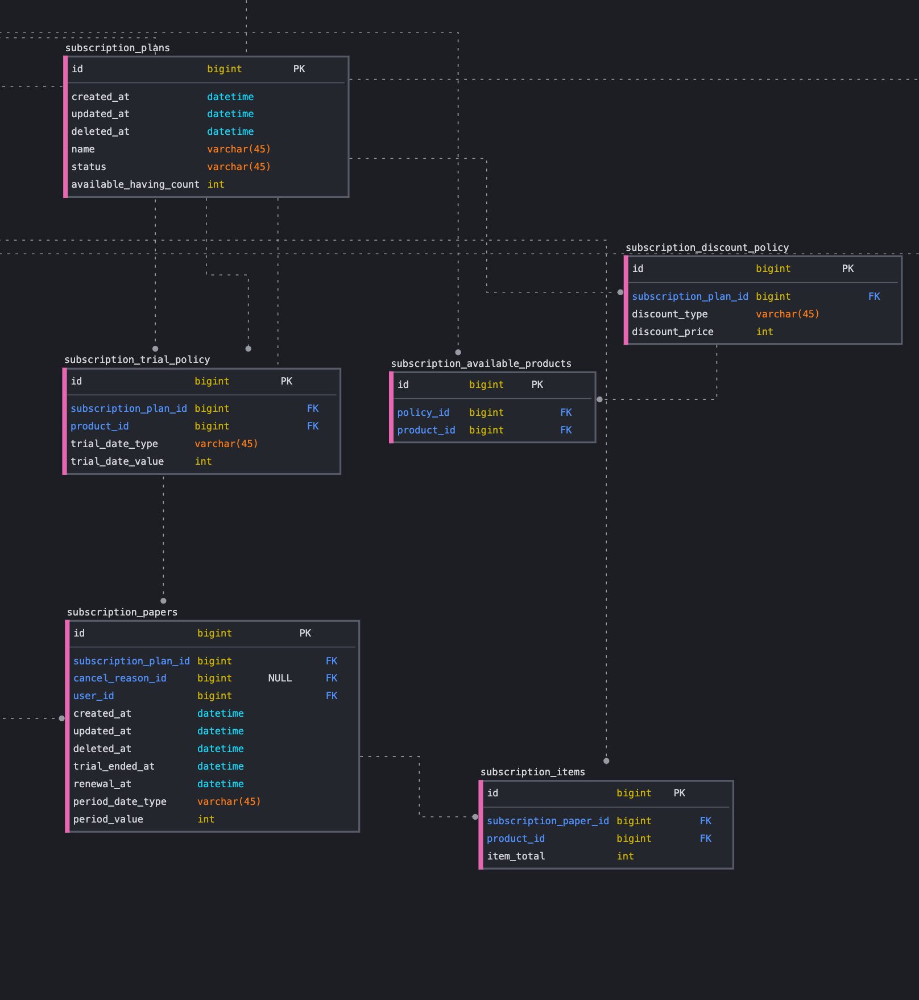
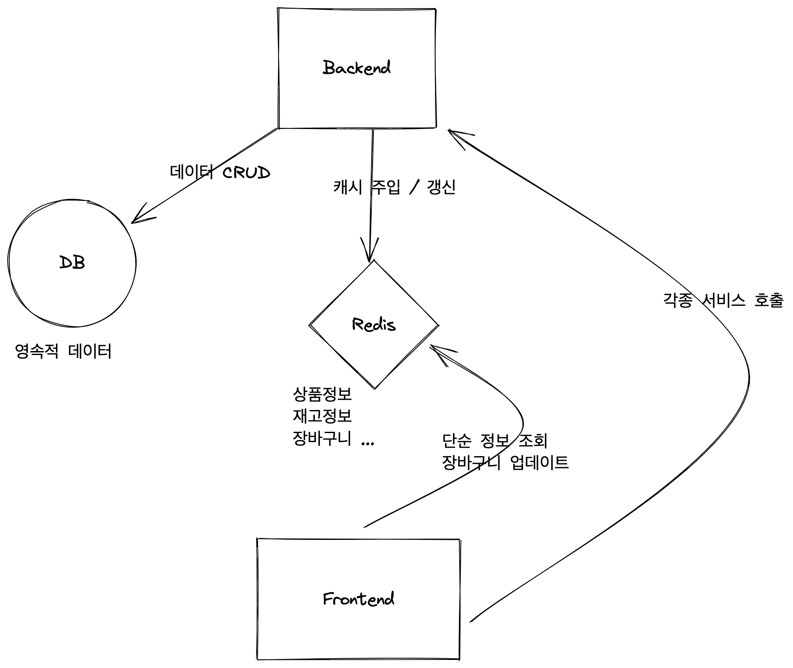
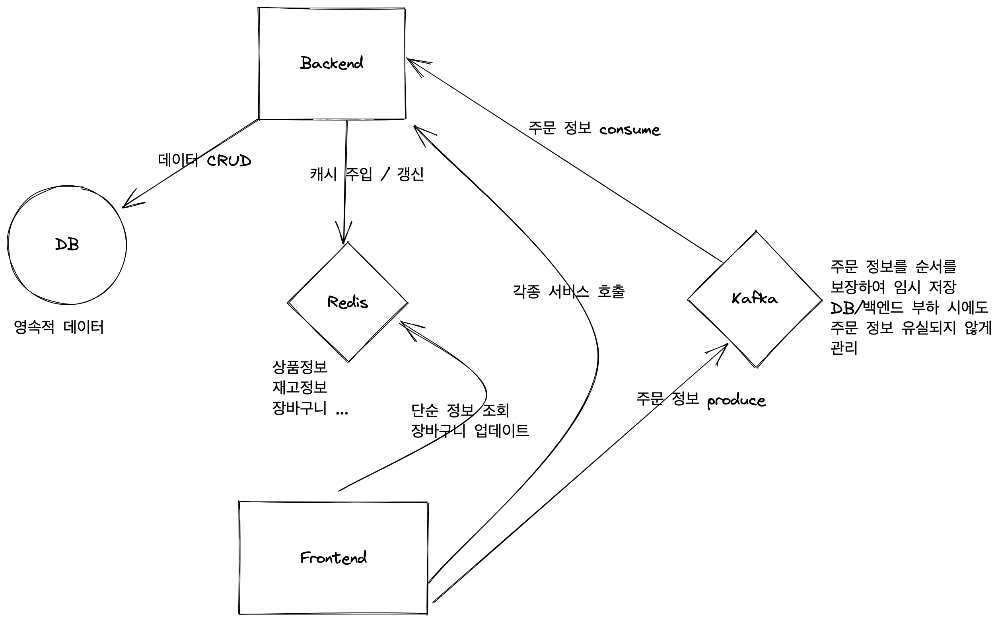

#### 들어가며

레이지소사이어티에 입사한 이유는 외주업체에 의해 워드프레스로 설계된 기존 시스템을 탈피해 확장 가능한 구독 커머스 시스템을 설계하기 위함이었다. 지난 1년 간 열심히 설계에 매진했지만 회사 경영이 악화되면서 많은 우여곡절을 겪었고, 결국 새로운 시스템 도입은 불가능할 것으로 결론이 내려졌다. 그동안 만들어 온 설계에 대한 확신이 있었기에 굉장히 아쉽긴 하지만 여기에 그간의 결과물을 정리해두려고 한다.

#### 비즈니스 요구사항

기존의 구독 시스템은 워드프레스 플러그인으로 이루어진 것이었으며, 여기에는 두 가지 커다란 제약 사항이 있었다.

- 주요 구독 상품과 추가 구독 상품으로 구매 상품의 위계가 나뉜다.
- 명시적으로 유저가 구독을 취소하지 않는 이상 구독은 영원히 계속된다.

이 두 가지 제약 사항은 유저의 변화하는 요구에 대응하지 못하게 하는 주요 원인이 되고 있었다. 유형의 상품을 구독하는 서비스의 경우 이제 대부분의 유저들이 '영원한 구독'이라는 규칙 자체를 부담스러워하는 경우가 많아졌다. 한국의 유저는 최대한 다양한 상품을 체험해보고 싶어한다. 특히 그루밍 용품이나 화장품의 경우는 '유목민'이라는 표현까지 나오고 있는 상황이다. 구독을 하더라도 네이버, 카카오 플랫폼 안에서 1-2회 구독 정도만 사용해보길 원하며, 끊임없이 구독 상품을 바꿔보기를 원한다. 그런 욕구에 비해 '정해진 상품을 영원히' 구독하게 하는 오래된 시스템은 합류 자체를 꺼리게 한다. 기존의 고객들도 마찬가지다. 면도날 8개입 상품에서 4개입 상품으로 구독 상품을 바꾸고 싶지만 아이템 변경이 쉽지 않다. 면도날이 아니라 화장품만 구독하고 싶다고 해도 그건 불가능하다. '주요 구독 상품'에 화장품을 추가할 것인가? 라는 의사결정이 이루어진 뒤에야 구독 상품을 게시할 수 있게 되어 있기 때문이다.

새로운 구독 시스템은 보다 유연하고 자유로워야 한다고 생각했다. 유저에 따라 완벽한 개인화가 가능한 구조, 언제든지 구독을 변경 - 연장 - 파기가 자유로운 구조로 거듭나야 했다.

물론 비즈니스적 요구사항도 만족시켜야 했다. 커머스 회사가 구독 시스템을 도입하는 이유는 무엇일까? 다달이 들어오는 갱신결제 매출을 통해 안정적인 수익 구조를 만들기 위함이다. 구독에 무제한의 자유를 준다면 오히려 정기적인 자동 배송에 따른 물류적 부담이 더 커질 수도 있었다. 이를 막기 위해 배달의민족이 각 가맹점 배달에 사용하는 '최소주문금액' 개념을 도입하는 것이 좋겠다 판단했다.

새롭게 설정한 구독 시스템의 요구사항은 다음과 같았다.

- 구독은 기간 제한이 없는 플랜과 있는 플랜 모두가 가능해야 한다.
- 구독은 최소주문금액만 만족시킨다면 상품의 위계구조 없이 자유롭게 체결할 수 있다.

#### DB 설계

전체 ERD 다이어그램 안에는 유저, 상품, 주문과 관련된 다양한 설계가 담겨 있지만 구독에 대한 핵심 구조만 살펴보도록 하겠다.



구독 관련한 테이블 구조는 다음과 같다. 관리자가 생성하는 구독 계획인 `subscription_plan`과 유저가 실제 보유하는 구독권인 `subscription_paper`가 주요 테이블이다.

플랜 테이블은 N개의 `discount_policy`(할인 정책 테이블)를 갖고, `products` 테이블과 associate 된다. 관리자가 플랜을 생성하고 할인 정책을 생성한 뒤 정책에 상품을 연결하면, 이제 구독은 해당 상품을 취급하게 되고 각 상품에 대한 할인 정책을 갖게 된다.

이러한 접근은 특정 구독 플랜은 특정 상품만을 취급한다는 결과를 낳게 된다. 설계 당시에는 전체 상품 가운데 관리자가 구독 판매를 원하는 상품만을 등록할 수 있게 하기를 바랐다. 하지만 다시 돌아보니, 전체 상품을 구독 취급하게 만들고자 할 때, 그 상품들의 갯수가 수십 - 수백 가지가 되면 어떻게 대응해야 하는가? 에 대한 해답으로는 충분하지 않은 것 같다.

#### 백엔드 설계

백엔드 언어는 golang을 선택했다. 타입 체크를 엄격하게 하는 컴파일 언어이지만 스크립트 언어처럼 손쉬운 실행이 가능하며, 가상머신을 필요로 하지 않고, 가비지 컬렉터를 가지며, 멀티코어를 활용할 수 있고, 고루틴을 이용하면 동시성 프로그래밍을 손쉽게 구현 가능하다는 점이 매력적이었다. 객체지향적 패턴을 따르지 않고, exception 없이 모든 에러를 값으로 처리한다는 특이한 철학을 갖고 있지만 지나친 추상화를 경계하고 실용적인 프로그래밍을 유도한다는 장점으로 받아들이기로 했다.

도입을 고려할 만한 서버 프레임워크가 많이 있었지만 결국 선택하지 않았다. 기본 `http` 패키지로 충분히 서버 프로그래밍이 가능하다는 글들을 많이 읽었기 때문이다. 나 또한 프레임워크가 제시하는 패턴을 타이핑만 하는 게 아니라 스스로 생각해서 구조를 쌓고 싶다는 생각을 했다.

설계를 위해 주로 참고한 문서는 이것이었다.

[How I implement Clean Code Architecture on Golang projects](https://nurcahyaari.medium.com/how-i-implement-clean-code-architecture-on-golang-projects-68be58830621)

###### 레이어

주요 레이어는 다음과 같은 4단계를 이룬다.

- entities: 데이터 객체를 정의하는 레이어. DB에서 정의된 데이터를 파싱받는 역할을 한다.
- repositories: 영속성 데이터(DB)를 핸들링하기 위한 여러 명령어를 담고 있는 인터페이스 레이어. 만일 DB나 ORM을 바꾸게 되면, 인터페이스를 유지한 채 리포지토리 구현만 새로 작성하면 된다. 이곳에는 비즈니스 로직이 담겨선 안 된다.
- services: 비즈니스 로직이 담기는 레이어. 이곳에는 DB 쿼리가 담겨서는 안 된다. 서비스는 리포지토리에 의존하므로 리포지토리를 서비스에 주입하는 형태가 되어야 한다. 서로 다른 서비스가 필요할 경우 다른 영역의 서비스를 주입할 수도 있다.
- handlers: MVC 패턴에서 '컨트롤러'의 역할을 맡는 레이어와 같다. 외부의 요청을 받아들여 요청을 처리하고 응답을 반환한다. 핸들러는 서비스에 의존하므로 서비스를 핸들러에 주입하는 형태가 될 것이다. 하지만 서비스와 달리 핸들러끼리는 서로를 주입하는 관계를 맺을 수 없다. 핸들러의 역할은 하나의 요청을 처리해 하나의 응답을 주는 것에 그쳐야 하기 때문이다. 앞서 말했듯 비즈니스 로직은 서비스 레이어에 고립되어야 한다.

여기에 DTO(Data Transfer Object) 레이어가 부속 레이어로 추가된다. DTO는 요청 및 응답 형식을 정의하는 객체 레이어다.

폴더 구조는 다음과 같이 자리하게 된다.

```
|-- db
|-- dto
|-- entities
|-- handlers
|-- middlewares /* 미들웨어. 인증 및 로깅 등등의 처리를 위한 레이어 */
|-- repositories
|-- router /* 라우터. 주소 매핑을 위한 레이어 */
|-- services
|-- main.go /* 메인 실행 파일 */
```

###### entities

엔티티부터 시작하자. `User` 영역을 설계한다면 다음과 같은 형태를 띄게 된다.

```go
package entities

import (
	"database/sql"
	"time"
)

type Users struct {
	Id             uint64       `gorm:"column:id"`
	CreatedAt      time.Time    `gorm:"column:created_at"`
	UpdatedAt      time.Time    `gorm:"column:updated_at"`
	Email          string       `gorm:"column:email"`
	DisplayName    string       `gorm:"column:display_name"`
	Phone          string       `gorm:"column:phone"`
	RecommendCode  string       `gorm:"column:recommend_code"`
	MarketingAgree sql.NullBool `gorm:"column:marketing_agree"`
}

func (u *Users) TableName() string {
	return "users"
}
```

엔티티는 유저 테이블의 형태를 갖게 된다. 테이블 이름을 리턴하는 메서드가 하나 담긴다.

###### repositories

리포지토리는 영속성 데이터 레이어를 호출하는 로직이 담긴다.

```go
package repositories

import (
	"github.com/lazysociety/lazy_backend_v3/entities"
	"gorm.io/gorm"
)

type UserRepository interface {
	SignUpUser(db *gorm.DB, user *entities.Users, info *entities.UserAccessInfo) (*entities.Users, *entities.UserAccessInfo, error)
	/* 기타 등등 다른 메서드... */
}

type userRepo struct {
}

func NewUserRepository() UserRepository {
	return &userRepo{}
}

func (r *userRepo) SignUpUser(db *gorm.DB, user *entities.Users, info *entities.UserAccessInfo) (*entities.Users, *entities.UserAccessInfo, error) {
	result := db.
		Table(user.TableName()).
		Create(&user)

	if result.Error != nil {
		return nil, nil, result.Error
	}

	info.UserId = user.Id

	result = db.
		Table(info.TableName()).
		Create(&info)

	if result.Error != nil {
		return nil, nil, result.Error
	}

	return user, info, nil
}
```

이 구현에서 다른 클린 아키텍처와 가장 큰 차이점이라면... db 객체를 리포지토리 구조체 멤버로 받는 게 아니라 메서드의 파라미터로 전달받는다는 점이다. 이렇게 설계하면 `gorm`에 의존 관계가 생겨서 다른 db로 교체하기가 힘들어진다. 그런데도 왜 이런 구현을 하게 되었는가? 하나의 요청을 처리할 때 여러 서비스를 동시에 호출하게 되는데, 그때 하나의 트랜잭션 객체로 모든 서비스를 함께 작동시키려면 개별 메서드가 db 객체를 받는 형태로 구현할 수밖에 없지 않나? 하는 의문이 생겼기 때문이다...

###### services

계속해서 서비스 레이어를 보자. 서비스 레이어는 리포지토리를 주입받아 실행된다.

```go
package services

import (
	"database/sql"
	wphash "github.com/GerardSoleCa/wordpress-hash-go"
	"github.com/lazysociety/lazy_backend_v3/dto"
	"github.com/lazysociety/lazy_backend_v3/entities"
	"github.com/lazysociety/lazy_backend_v3/repositories"
	"gorm.io/gorm"
	"time"
)

type UserService interface {
	SignUpUser(db *gorm.DB, data *dto.UserRequestBody) (*entities.Users, *entities.UserAccessInfo, error)
	/* 기타 등등 다른 메서드... */
}

type userService struct {
	UserRepository  repositories.UserRepository
	PointRepository repositories.PointRepository
}

func NewUserService(userRepository repositories.UserRepository, pointRepository repositories.PointRepository) UserService {
	return &userService{
		UserRepository:  userRepository,
		PointRepository: pointRepository,
	}
}

func (s *userService) SignUpUser(db *gorm.DB, data *dto.UserRequestBody) (*entities.Users, *entities.UserAccessInfo, error) {
	marketingAgree := false

	if data.MarketingAgree == dto.AgreeYes {
		marketingAgree = true
	}

	if data.MarketingAgree == dto.AgreeNo {
		marketingAgree = false
	}

	user := entities.Users{
		Email:         data.Email,
		DisplayName:   data.DisplayName,
		Phone:         data.Phone,
		RecommendCode: utils.CreateRecommendCode(),
		MarketingAgree: sql.NullBool{
			Bool:  marketingAgree,
			Valid: true,
		},
	}

	info := entities.UserAccessInfo{
		RegisteredBy: data.RegisteredBy,
		AuthGrade:    data.AuthGrade,
	}

	if data.RegisteredBy == "" {
		info.RegisteredBy = dto.RegisteredByLazy
	}

	if data.AuthGrade == "" {
		info.AuthGrade = dto.AuthGradeUser
	}

	if data.SocialId != "" {
		info.SocialId = data.SocialId
	}

	if data.Password != "" {
		info.Password = wphash.HashPassword(data.Password)
	}

	resultUser, resultInfo, err := s.UserRepository.SignUpUser(db, &user, &info)
	if err != nil {
		return nil, nil, err
	}

	point := entities.Points{
		UserId:       resultUser.Id,
		CurrentTotal: 0,
	}

	_, err = s.PointRepository.CreatePoints(db, &point)
	if err != nil {
		return nil, nil, err
	}

	return resultUser, resultInfo, nil
}
```

유저 서비스는 유저에 관련된 비즈니스 로직을 담는 레이어다. 유저 리포지토리와 함께 포인트 리포지토리를 주입받아 유저가 가입할 시 포인트 테이블을 생성한다. 추후에는 유저가 프로모션을 통한 가입을 할 시 포인트를 지급받은 채 가입되는 식으로 추가 구현을 할 예정이었다.

생성자 함수를 보면, 리포지토리 인터페이스를 파라미터로 받아 서비스 인터페이스를 반환하는 것을 볼 수 있다. golang은 인터페이스를 통해 다형성을 만들어내므로, 해당 인터페이스를 만족하는 구조체가 추가로 만들어진다면, 즉 다른 DB로 리포지토리가 구현된다면 역시 유저 서비스에 주입될 수 있다. 이론적으로는 그렇다. `gorm` 객체를 메서드가 직접 주입받는 형태가 아니라면 말이다...

###### handlers

왜 `gorm` 객체를 직접 메서드가 전달받는 설계를 했는가? 아직도 스스로 해결하지 못한 트랜잭션의 일관성 문제 때문이다.

```go
package handlers

import (
	"encoding/json"
	"github.com/go-playground/validator/v10"
	"github.com/lazysociety/lazy_backend_v3/dto"
	"github.com/lazysociety/lazy_backend_v3/services"
	"github.com/lazysociety/lazy_backend_v3/web"
	"gorm.io/gorm"
	"net/http"
)

type UserHandler interface {
	SignUpUser(w http.ResponseWriter, r *http.Request)
	/* 기타 등등 다른 메서드... */
}

type userHandler struct {
	UserServices services.UserService
	DB           *gorm.DB
}

func NewUserHandler(userService services.UserService, db *gorm.DB) UserHandler {
	return &userHandler{
		UserServices: userService,
		DB:           db,
	}
}

var validate *validator.Validate

func (h *userHandler) SignUpUser(w http.ResponseWriter, r *http.Request) {
	var userRequestBody dto.UserRequestBody
	if err := json.NewDecoder(r.Body).Decode(&userRequestBody); err != nil {
		msg := web.ErrorMessageResponse{
			Okay:    false,
			Message: err.Error(),
		}
		web.ReturnJson(w, &msg, http.StatusBadRequest)
		return
	}

	validate = validator.New()
	if err := validate.Struct(&userRequestBody); err != nil {
		msg := web.ErrorFieldMessageResponse{
			Okay: false,
		}
		for _, err := range err.(validator.ValidationErrors) {
			field := web.ErrorFieldMessage{
				Field:     err.Field(),
				Condition: err.Tag(),
				CurValue:  err.Value(),
			}
			msg.Message = append(msg.Message, field)
		}
		web.ReturnJson(w, &msg, http.StatusBadRequest)
		return
	}

	if userRequestBody.SocialId == "" && userRequestBody.Password == "" {
		msg := web.ErrorFieldMessageResponse{
			Okay: false,
			Message: []web.ErrorFieldMessage{
				{
					Field:     "Password",
					Condition: "required",
					CurValue:  "",
				},
			},
		}
		web.ReturnJson(w, &msg, http.StatusBadRequest)
		return
	}

    // 문제의 트랜잭션 코드
	tx := h.DB.Begin()
	defer func() {
		if r := recover(); r != nil {
			tx.Rollback()
		}
	}()

	newUser, newInfo, err := h.UserServices.SignUpUser(tx, &userRequestBody)
	if err != nil {
		tx.Rollback()
		msg := web.ErrorMessageResponse{
			Okay:    false,
			Message: err.Error(),
		}
		web.ReturnJson(w, &msg, http.StatusBadRequest)
		return
	}

	tx.Commit()
	msg := dto.UserResponseBody{
		CreatedAt:      newUser.CreatedAt,
		LastLoginAt:    newInfo.LastLoginAt.Time,
		Email:          newUser.Email,
		DisplayName:    newUser.DisplayName,
		Phone:          newUser.Phone,
		RecommendCode:  newUser.RecommendCode,
		MarketingAgree: newUser.MarketingAgree.Bool,
		RegisteredBy:   newInfo.RegisteredBy,
		AuthGrade:      newInfo.AuthGrade,
	}
	web.ReturnJson(w, &msg, http.StatusCreated)
	return
}
```

회원가입 핸들러에서는 그 예시가 만들어지지 않았지만, 만일 핸들러가 여러 서비스를 동시에 처리해야 하는 상황이 찾아온다면 그땐 어떻게 해야 하는가? 라는 문제를 해결하지 못했다. 리포지토리가 각각 db 객체를 주입받는 상황이라면 단일한 트랜잭션 처리를 할 수 없게 된다. 그래서 어쩔 수 없이 서비스가 직접 트랜잭션 객채를 받아 리포지토리까지 drilling해주는 상황을 만들고 말았다. 이 부분을 해결할 수 있다면 좋을 것 같은데... 아직은 답을 모르겠다.

#### 인프라

인프라 영역은 실제 구현까지는 못하고 설계만 진행한 상태였다. 실제 쇼핑몰을 운영하면서 가장 문제가 됐던 부분은 장바구니 정보와 세션이 DB에 직접 담기고, 그 빈번한 장바구니 업데이트가 모두 DB에서 처리되어 접속자가 조금만 튀어도 DB 부하가 엄청나게 발생한다는 점이었다. 그로 인해 정작 중요한 주문 관련 요청이 제때 처리되지 않아 구매 이탈이 많이 발생했다. 이를 해결하기 위해 업데이트가 빈번한 장바구니 데이터는 NoSQL이나 Redis에 저장하는 방식을 구상했다. 상품정보나 가격, 재고 정보 또한 캐시 레이어에서 제공함으로써 DB 부하를 줄이고 싶었다.

많이 참고한 자료는 쿠팡의 유튜브였다.

###### Reveal2021 - 쿠팡의 대규모 트래픽을 다루는 백앤드 전략

<iframe width="100%" height="480" src="https://www.youtube.com/embed/qzHjK1-07fI?start=308" title="YouTube video player" frameborder="0" allow="accelerometer; autoplay; clipboard-write; encrypted-media; gyroscope; picture-in-picture" allowfullscreen></iframe>

###### 백지 설계 v1

주문 관련 프로세스를 생각하지 않고 처음에 구현한 내용이다.



쿠팡의 거대한 MSA 설계보다는 훨씬 모놀리틱하다. 다만 단순 조회용 데이터나 중요도가 높지 않으면서 업데이트가 잦은 장바구니 데이터는 Redis에서 관리하는 식으로 설계해보았다.

물론 백엔드, 프론트엔드, Redis는 부하 정도에 따라 오토 스케일링이 가능해야 할 것이다. 여기서 쿠버네티스를 떠올릴 수도 있을 것이다. '쿠버네티스는 클라우드의 운영체제이다' 라는 말이 나올 만큼 쿠버네티스를 이용한 인프라 구축이 표준화된 시기이긴 하다. 하지만 현재 우리 트래픽 수준에서 쿠버네티스까지 도입하는 것은 낭비가 아닐까? 라는 생각이 들기도 했다. 물론 테스트 환경을 구축하는 비용까지 생각한다면 얘기가 달라질 수는 있다.

###### 백지 설계 v2 (with 주문)

주문은 누락이 발생해서는 안 되는 중요한 이벤트이다. 이걸 그저 http 통신으로 처리한다면 실패의 여지가 많을 것이다.

재고가 모자란 상황에서 주문 트래픽이 몰려 품절이 발생한다면, 근데 서버 부하로 인해 실시간으로 품절 처리가 되지 않아 과잉된 주문이 발생했다면? 이럴 경우 순서가 보장된 주문 이벤트를 보유하고 있어야 백엔드에서 알맞은 주문 체결 및 거절이 가능해질 것이다.

이를 위해선 Kafka가 주문 이벤트를 보유해야 한다고 생각했다.



Kafka를 통해 주문 요청을 송신하는 것까진 가능할 것이다. 그러면 그 후에 주문을 처리해서 클라이언트에 제대로 응답을 주려면 어떻게 해야 할까? Kafka를 이용해 다시 한번 응답을 반환하거나, WebSocket을 이용해 클라이언트에 응답을 전송하는 것도 가능할 것이다. 이 부분까지는 구체적인 구상을 해 보지 못했다.

#### 마치며

머릿속으로만 정리했을 땐 명쾌하다고 생각했는데, 실제로 글로 옮겨보니 아직 미숙한 부분이 많아 보이는 설계였다. 더 제대로 된 설계 능력을 배우고 싶다는 생각이 들었다. 최고의 스승은 경험이라고 믿고 있기에, 멋진 멘토가 있는 팀을 가거나 제대로 된 트래픽을 경험할 수 있는 곳에 몸담아보고 싶어졌다.
