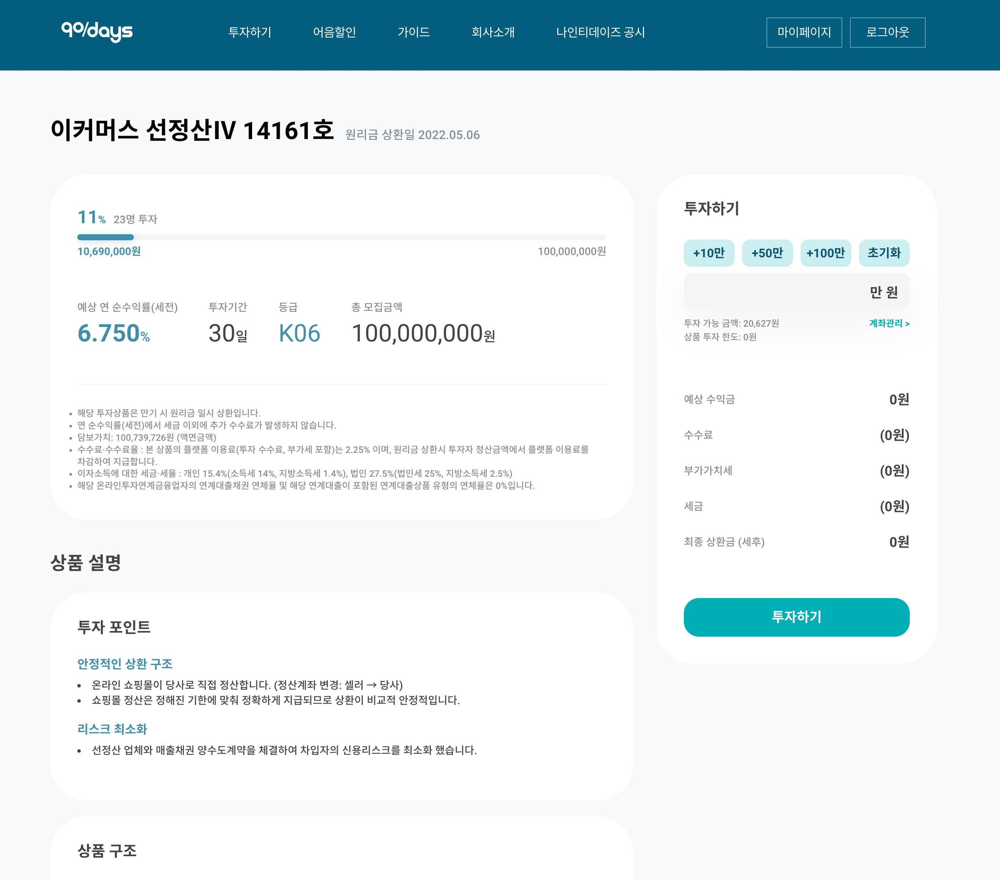
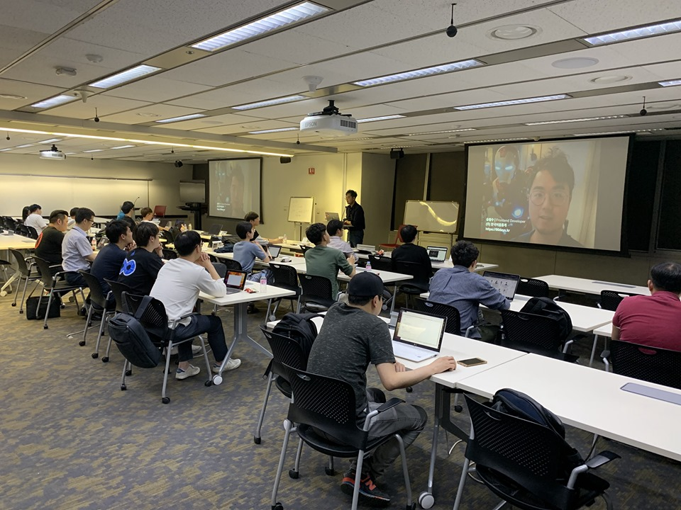
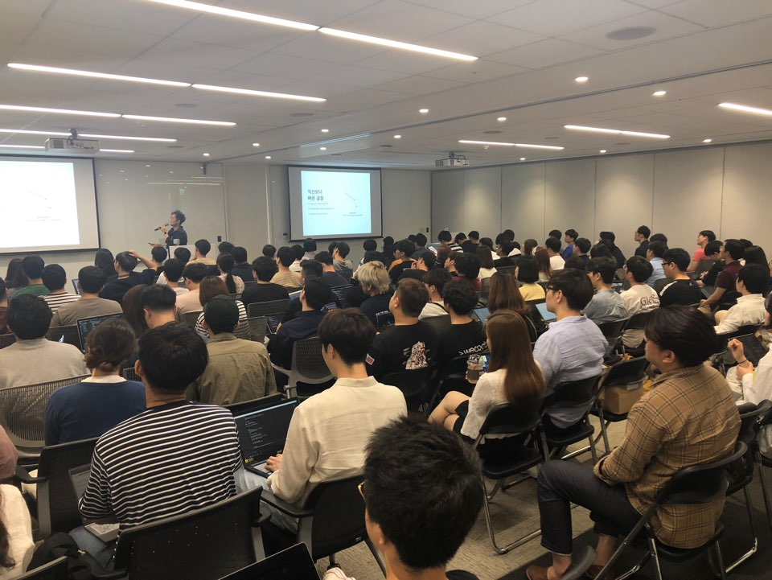

#### 경력

###### 노써치, 2022.06 ~ 현재

[노써치](https://nosearch.com)는 가전제품 비교분석 컨텐츠를 제작하는 이커머스 스타트업입니다.

프론트 / 백엔드 영역 전반에 걸쳐 서비스 품질을 향상시킬 수 있는 모든 feature를 개발하는 중입니다.

- TypeScript Next.js 기반 스토어 웹사이트 리뉴얼
  - 상품 상세 페이지 재설계
  - 기존에 사용 중이었던 고도몰 쇼핑몰의 결제 컴포넌트만 iframe으로 가져와 유지 운영
- Node.js 전자제품 스펙 데이터 크롤러 제작
  - fastify, crawlee, prisma, postgreSQL 사용
  - 다나와에서 사용자가 등록한 카테고리의 가전제품 전체를 크롤링
  - 매일 자정마다 최신 최저가를 추가 저장하여 최저가 변동 추이를 확인할 수 있게 함
  - GCP 환경 위에 terraform을 사용하여 전체 리소스 형상관리
  - Cloud Run, Pub/sub, Cloud tasks, Cloud Scheduler 등 사용

###### 레이지소사이어티, 2021.03 ~ 2022.05

[레이지소사이어티](https://lazysociety.co.kr)는 면도기 구독 서비스를 제공하는 이커머스 스타트업입니다.

기존의 커머스 백엔드 시스템 재설계 배포하는 것을 목표로 업무를 진행했습니다.

- 신규 커머스 시스템의 DB 설계 및 인프라 설계
  - MySQL DB 설계
  - 리포지토리 패턴을 도입한 Golang 기반 백엔드 서버 설계
  - Kafka, Redis를 이용한 주문 및 장바구니 서비스의 비동기 처리 설계
- AWS 인프라 재설계
  - VPC 제작 후 Public/Private 서브넷 분리하여 민감한 리소스는 격리된 Private 서브넷에서 관리
  - OpenVPN 도입하여 필요한 인원만 Private 서브넷 접근하도록 설계
  - Auto Scaling Group을 활용해 트래픽에 따라 확장 가능한 백엔드 시스템 제작
  - 과도한 스펙으로 책정된 AWS RDS 인스턴스를 알맞은 크기로 마이그레이션하여 연간 약 2,600만 원 비용 절감
- Redash를 이용한 각종 서비스 지표 시각화 운영
  - RDBMS 데이터와 Google Analytics 데이터를 하나의 SQL 문법으로 통합 조회
  - 재구매율 코호트 차트, 구매 전환율, ARPPU 지표 측정

###### 크로스파이낸셜, 2019.01 ~ 2021.03

크로스파이낸셜(구 한국어음중개)은 소상공인을 위한 전자어음 할인 서비스를 제공하는 P2P 금융 스타트업입니다.

[나인티데이즈](https://90days.kr)

- JSP 기반 웹사이트를 React로 전환
  - AWS ECS Fargate 컨테이너 및 CodePipeline 구축
  - CloudFormation을 이용한 리소스 관리
  - Webpack4, Express, React를 이용한 SSR 환경 직접 구축 (CRA 도입 후 직접 구축을 위해 제거)
  - 공동인증서 모듈을 이용한 금융결제원 전자어음 서버 스크래핑
- P2P 가이드라인 및 온라인투자연계금융업법(이하 온투업법) 인가 준비
  - 온투업법 요구조건 분석 및 사내 공시지표 페이지 제작
  - AWS에서 네이버 클라우드로 인프라 이전 경험
- 대출자 전용 플랫폼 개발
  - 협력사 전용 어음 할인 신청, 약정서 전자 서명 서비스 제작

#### 프로젝트

###### num-to-korean, 2020

num-to-korean은 숫자를 한글 표기로 변환해주는 함수입니다. 간단한 하나의 함수만 있습니다. 일의자리부터 경 단위까지의 모든 숫자를 한글로 변환해줍니다. 은행 등 금액을 다루어야 하는 환경에서 편리하게 사용할 수 있습니다.

- [Github](https://github.com/huskyhoochu/num-to-korean) | 2022년 현재 star 66
- [npm](https://www.npmjs.com/package/num-to-korean) | 주간 평균 다운로드 480여 건
- [Blog](/dev/num-to-korean) | 금액-한글 변환 프로젝트 npm 배포하기

#### 강연

###### AWS 한국사용자모임, 2019

백엔드를 재발명하지 않는 방법들 - AWS Amplify & Cognito

[22번째 모임](https://github.com/awskrug/architecture-group#22%EB%B2%88%EC%A7%B8-%EB%AA%A8%EC%9E%84-2019%EB%85%84-5%EC%9B%94-30%EC%9D%BC-%EB%AA%A9%EC%9A%94%EC%9D%BC-%EC%98%A4%ED%9B%84-7%EC%8B%9C)

[SlideShare](https://www.slideshare.net/LanarkSeung/aws-amplify-cognito)

###### JS is Everywhere, 2019

Create-React-App으로 SSR을 구현하며 배운 점 (feat. TypeScript)

[JavaScript is Everywhere 2019](https://js2019.splashthat.com/)

[SlideShare](https://www.slideshare.net/LanarkSeung/createreactapp-ssr-feat-typescript)

#### 학력

###### 한국방송통신대학교 컴퓨터과학과 휴학, 2020.03 ~

###### 경희대학교 국어국문학과 졸업, 2009.03 ~ 2017.08

#### 과거에는...

###### <오늘부터 하모니>, 2015

보컬 대회에 나가기 위해 동아리 막내 아린은 다문화 전학생 하리를 데려오는데..

다문화가족에 대한 우리의 편견과 잘못된 시각에 대해 생각해보는 드라마!

연출: 강민구

기획: (주)이지스커뮤니케이션즈, 페이퍼필름

제작: 페이퍼필름

극본: 승형수, 오혜성

제작지원: 여성가족부, 복권위원회

[네이버 TV 공식 홈페이지](https://tv.naver.com/ourharmony)

[동아출판 고등 국어 교과서](https://www.bookdonga.com/textbook/book_view.donga?product_seq=31753) | 효과적인 의사소통 단원에 작품 등재

###### <회춘 100km>, 2015

인생, 젊은이들만 즐기란 법 있어? 할배들의 청춘도 아직 끝나지 않았다!

67세 모태솔로남 한길만과 62세 순정마초남 전국도가 펼치는 도로 위의 낭만 여행기!

연출: 강민구

제작: 페이퍼필름

극본: 승형수, 오혜성

제작지원: 한국도로공사

[네이버 TV 공식 홈페이지](https://tv.naver.com/100km)

#### QnA - TL;DR

###### 채용 담당자는 언제나 시간이 모자랍니다. 자신의 장점을 짧게 요약해주세요.

**간단 요약**

저는 사람들의 서로 다른 눈높이를 파악해 소통을 돕는 것에 강합니다.

**더 읽어보기**

세상에는 컴퓨터공학과 출신의 뛰어난 개발자도 많이 있습니다. 하지만 팀에는 다른 분야에 대한 경험이 풍부한 개발자도 반드시 필요하다고 생각합니다. 사회인이 된 이후에 개발을 시작하여 그 어려운 세계를 학습하느라 노력했던 경험이 있기에, 저는 IT 직군과 비 IT 직군의 사고방식 모두를 이해하여 상대가 이해하기 편한 말로 커뮤니케이션 할 수 있습니다.

신규 프로젝트를 시작할 때 자바, 파이썬 중 어떤 언어를 선택할지 의사결정을 해야 할 때를 생각해봅시다. **개발자는 기획자에게 두 언어가 타입을 체크하는 방식이 다르고 그에 따라 개발팀의 설계 방식도 달라지기에 만들려는 제품에 따라 알맞은 언어를 선택해야 한다는 점을 이해시켜야 합니다. 이때 인터프리터, 컴파일러 등등의 어려운 단어 대신에 저는 '야구' 라는 비유를 들 줄 압니다.** "야구에는 공을 던지는 투수와 받는 포수가 있습니다. 두 사람은 언제 어떤 공을 주고받을지 미리 약속하죠. 처음엔 포크볼을, 위기에 몰렸을 땐 직구를, 허를 찌를 때에는 슬라이더를 던진다고요. 투수와 포수는 미리 정해둔 수신호를 이용해 다음 공의 구질을 결정합니다. 이게 타입이에요. 자바 팀의 투수는 9이닝 내내 미리 정해둔 순서대로만 공을 던집니다. 연습이 철저했다면 완벽한 피칭을 선보이지만 포수와 팀워크를 쌓기까지 까다로운 노력을 해야 합니다. 파이썬 팀은 실제 경기 상황에 따라 유연하게 공을 던집니다. 두 선수가 고수라면 경기 전에 잠깐만 합을 맞추더라도 훌륭한 퍼포먼스를 낼 수 있습니다. 하지만 서로의 센스만 믿고 긴 경기를 소화하는 데에는 위험이 따를 수 있죠. 저희 팀은 결제 프로세스를 구현해야 하므로 타입을 철저하게 체크하는 자바를 선택하는 편이 좋을 것 같습니다. 기획자 님 의견은 어떠신가요?" 이것이 저의 방식입니다.

반대의 경우도 있겠죠. CS 담당자가 "유저가 결제를 눌렀는데 안 된대요." 라고 말한다면 저는 그 문제를 면밀히 파악한 뒤 동료 개발자에게 이렇게 전할 것입니다. "결제 버튼에 알맞은 인터렉션을 만들지 않아 사용자가 오류가 있다고 인식하는 것 같아요. 버튼을 만들 때마다 매번 새로 구현하기 때문에 개발자가 인터랙션 구현을 잊으면 미스가 발생할 여지가 있네요. 모든 버튼이 일관된 행동 규칙으로 인터랙션을 수행하도록 재사용 가능한 컴포넌트를 구상해야 할 것 같습니다."

###### 소통을 통해 성과를 낸 사례가 있나요?

**간단 요약**

레이지소사이어티에서 작업했던 DB 인스턴스 마이그레이션 작업이 떠오르네요. 기존 인스턴스가 실제 사용량에 비해 지나치게 많은 스토리지가 책정되어 있어서 불필요한 요금이 새는 상황이었습니다. 이를 해결하기 위해 스토리지가 더 작은 인스턴스를 만들어 사내 데이터 전체를 이관했습니다. 이때 대표님은 물론 AWS 환경을 구성했던 외주업체도 설득해야 했는데요. 결국 마이그레이션에 성공해 연간 2,600만 원의 고정비를 절약할 수 있었습니다.

**더 읽어보기**

당시 사내 AWS 환경은 외주업체가 구성한 것이었는데, 회사의 성장 가능성을 너무 높게 평가한 나머지 기본 스토리지를 1TB 가까이 할당하여 운영 중이었습니다. 트래픽 부하를 분산시키려는 목적으로 사내 데이터 조회용 Read Replica까지 운영 중이었는데, 이건 2TB나 되는 스토리지를 할당 중이었습니다. 실제로 사용하고 있는 용량은 그에 비해 턱없이 적었고 (정확한 수치를 밝힐 순 없습니다만), 평소 메인 인스턴스의 트래픽도 낮은 편이어서 불필요한 요금이 청구되는 원인이 되고 있었습니다. 스토리지 용량을 줄일 수 있다면 좋았겠지만 RDS는 한번 늘려잡은 용량은 다시 줄일 수가 없었습니다. 인스턴스를 새것으로 교체해야만 요금을 절감할 수 있었죠.

회사나 외주업체 입장에서는 현재 환경을 유지하는 편이 더 안전했습니다. 데이터를 이관하는 동안 정기 구독 자동결제 시스템에서 사고가 날 수 있었고, 기존 투자사에서 AWS 크레딧을 준 것이 있어서 당분간은 회사 재정을 지출하지 않아도 환경을 유지하는 게 가능했거든요.

**여기서부터 설득이 필요했습니다. 특별한 전략이 있는 것은 아니었습니다. 우려되는 문제에 대해 합리적인 해결책을 제시하고, DB 이관을 통해 우리가 얻게 될 이익을 정확한 수치로 보여주는 게 전부였죠. 그게 정답이라고 생각했습니다.**

먼저 서비스에 차질이 생기지 않도록 데이터 마이그레이션을 다운타임 없이 진행할 수 있는 방법을 찾아야 했습니다. [AWS DMS](https://aws.amazon.com/ko/dms/)를 찾아낸 게 그때였죠. DMS는 Database Migration Service의 줄임말로, RDS 데이터를 소스에서 타겟으로 다운타임 없이 전송해주는 서비스입니다. 하나의 소스 데이터를 동시에 여러 타깃으로 보내는 것도 가능하고, MySQL에서 PostgreSQL, Oracle 등 이종 간의 마이그레이션도 지원했습니다. 지속적 복제 기능도 있어서 단순히 현재 시점의 데이터를 옮기는 것에서 끝이 아니라 소스 DB의 변경 사항을 실시간으로 동기화시키는 것도 가능합니다. 이걸 이용하면 서비스를 중단시킬 필요 없이 데이터를 이관할 수 있을 것으로 생각되었습니다.

[AWS Pricing Calculator](https://calculator.aws/)를 이용해 예상 절감 비용을 계산하기도 했습니다. 동일한 인스턴스에서 스토리지를 줄이고 굳이 필요하지 않은 Read Replica를 제거하는 것만으로 연간 2,600만원의 비용이 절감된다는 사실을 수치로 산출해냈습니다. 개발자 외의 사내 직원이 메인 DB를 조회하는 것이 위험하다면 읽기 전용 계정을 만들어 사용하게끔 하자는 대안을 준비했습니다.

서비스 운용 대책과 예상 절감 비용을 제시하니 대표님은 물론 외주업체도 금방 제 의견에 동의해주셨습니다. 저는 지체없이 작업을 시작했습니다. 하지만 DMS를 사용하면서 예상치 못한 이슈를 겪었습니다. DMS로 이전을 마친 DB의 조회 속도가 지나치게 느렸던 것입니다. 원인을 추적한 결과 DMS를 통해 이관된 DB 데이터는 모든 인덱스가 벗겨진 상태가 된다는 것을 발견했습니다. 여러 워드프레스 플러그인이 복잡하게 설치되어 200개가 넘어가게 된 테이블 인덱스를 일일이 수동으로 다시 입혀주는 것은 불가능했죠. 결국 서비스를 일시중단하고 그 사이에 DB dump 데이터를 손으로 옮길 수밖에 없겠다는 결론이 났습니다.

설득을 한번 더 진행해야 했습니다. 결제 기록을 조회해 트래픽이 가장 적은 시점이 새벽 2-4시라는 걸 찾아낸 뒤, 작업을 진행할 시간 동안에 사이트를 닫고 자동 결제 건을 아침 시간대로 미루겠다는 계획을 대표님께 알렸습니다. 어드민과 백엔드 서버 또한 새로 바뀔 DB의 엔드포인트를 바라보도록 바로 세팅하겠다고 말씀드렸죠. 그리하여 모든 준비를 마치고 새벽 시간대에 무사히 DB 데이터를 이관하는 데 성공했습니다. 아침에 출근한 운영팀이 이상 없이 어드민에 접속하는 걸 확인하고, 자동 결제 및 홈페이지 결제 또한 새 DB에서 정상적으로 이루어지기 시작한 걸 확인하고 나서야 쓰러지듯 잠들 수 있었습니다.

###### 기술적으로 도전적이었던 업무가 있었다면 그것도 말해주세요.

레이지소사이어티에서 진행했던 Ghost CMS 서비스 도입 작업과, 크로스파이낸셜에서 작업했던 금융결제원 전자어음 서버 스크래핑 작업이 가장 까다로웠던 것 같습니다.

**Ghost CMS 서비스 도입**

사내 경영 악화로 IT 팀원들이 모두 퇴사한 뒤, 저는 TO-BE 서버 설계를 모두 멈추고 프론트엔드 운영 책무를 넘겨받아야 했습니다. 가장 큰 문제는 하드 코딩된 상품 상세 페이지였는데요. **인력이 많을 때에는 신제품이 출시될 때마다 상품 상세 페이지를 개발자가 직접 제작했지만 관리할 직원이 저 하나뿐인 상황에서는 개발 없이 상품 등록을 할 수 있는 방법을 찾아야 했습니다.** 설령 인원이 충분하다고 해도 상품 정보는 마케팅 팀에서 자유롭게 만들어가야 하는 부분인데 수정할 거리가 생길 때마다 개발자에게 요청해 코드를 고쳐야 하는 구조는 비합리적이라고 여겨졌습니다. 마케팅 영역과 IT 영역의 지나친 결합 상태를 부수고 느슨한 관계를 만들어야 했죠.

기존 서버인 워드프레스의 기능을 활용하거나, 상품 등록 에디터를 직접 만들거나, 이미 존재하는 다른 Headless CMS 서비스를 붙이는 방법 중 한 가지를 골라야 했습니다. 처음 두 가지 선택지는 금방 반려되었습니다. 워드프레스는 외주업체가 온갖 플러그인을 덧대 API 서버로 개조하여 제공하고 있었기 때문에 어드민 페이지로 주문 관련 운영을 하는 것 외에는 별달리 활용할 여지가 없었습니다. 에디터를 직접 만드는 것도 '바퀴를 발명'하는 수준의 쓸데없는 리소스 낭비로 보였습니다.

Strapi와 Ghost 중에 하나를 고르기로 마음먹었는데요. 두 서비스 모두 어드민 권한 관리가 가능했고 API로 데이터를 제공할 수 있는 장점이 있었습니다. 고민 끝에 Ghost를 선택했습니다. Strapi는 자유로운 데이터 구조 커스텀은 가능했지만 WYSIWYG 에디터를 추가로 선정해 덧붙여야 한다는 부담이 컸습니다. Ghost는 데이터 구조를 손댈 수 없다는 단점이 있었지만 곧장 사용 가능한 에디터를 갖고 있었죠.

그렇게 저는 Ghost CMS를 도입해 프론트엔드와 연결했고, 상품 포스트를 발행해 API로 전달받아 홈페이지에 출력했습니다. 신제품 상세 정보는 제품 팀과 마케팅 팀에서 관리했고 포스트를 publish 하면 홈페이지에 상품이 게시되는 구조를 만들었습니다. 갑작스레 제품이 품절되는 상황에 코드를 지워서 상품을 내리는 게 아니라 CMS 서비스를 통해 품절 처리를 손쉽게 수행할 수 있었습니다.

문제점이 모두 해결된 건 아닙니다. 완전히 걷어내지 못한 하드 코딩 데이터가 여전히 남아 있고, 워드프레스와 함께 이중의 CMS를 쓴다는 게 오히려 더 기형적으로 보일 수도 있겠다는 생각이 들기도 했습니다. **실제 구현의 어려움보다도 더 나은 구조를 고민하는 과정이 더 힘들었던 기억이 납니다.**

그래도 이 작업을 하며 많은 것을 배웠습니다. 잘못된 설계는 잘못된 운영을 불러오며, 그걸 바로잡기란 시간이 갈수록 어려워진다는 사실입니다. 거시적 관점의 아키텍쳐부터 코드 레벨의 설계에 이르기까지, 언 발에 오줌 누는 격의 임기응변 개발을 거듭한다면 그걸 수습하기 위해 또 다른 안티패턴이 도미노처럼 이어질 수밖에 없습니다. 언제 어디서든 리팩터링을 멈추지 말아야 한다는 교훈을 얻은 시간이었습니다.

**공동인증서 모듈을 이용한 금융결제원 전자어음 서버 스크래핑**

크로스파이낸셜에서는 솔루션 업체가 제공해 준 공동인증서 모듈을 이용해 전자어음 서버를 스크래핑한 경험이 있습니다.

솔루션 업체가 준 것은 exe 인스톨러와 자바스크립트 모듈 두 가지였고, 작업 흐름은 다음과 같았습니다. 자바스크립트 모듈을 통해 홈페이지에 팝업을 띄우면 유저가 팝업을 통해 공동인증서 로그인을 합니다. 모듈은 유저의 컴퓨터에 설치된 exe 프로그램에 인증 데이터를 전송해 신원을 확인합니다. 프로그램은 금융결제원 사이트에서 전자어음 정보를 스크래핑해 다시 모듈로 반환합니다.

전체적인 흐름은 간단했지만 jQuery로 범벅되어 있는 모듈을 React 프로젝트에 이식하는 과정이 매우 번거로웠습니다. **소스코드가 TypeScript 기반이어서, 흔히 `$` 심벌로 명명되는 jQuery 객체를 모듈 소스의 수정 없이 호출하려면 추가적인 세팅을 해 줘야 했습니다.** Window namespace에 `$` 심벌을 등록해주고, 모듈이 지원하는 것과 정확히 같은 버전의 jQuery를 CDN 링크로 html에 삽입하는 것으로 모듈 호출을 가능케 했습니다.

전형적인 콜백 패턴의 모듈 API는 활용하는 데 불편함이 컸습니다. API를 Promise 함수로 감싸서 프로젝트 내의 다른 비동기 함수들과 함께 사용했습니다.

이 작업은 제게 새로운 화두를 던져주었습니다. **"금융 관련 IT는 특히 레거시와의 공존이 필수인 것 같구나. 이런 환경을 개선해볼 순 없을까?"** 그 후로는 비즈니스 환경에서의 근본적인 문제 해결, 근본적인 구조 개선을 이뤄내는 곳에서 일해보고 싶다는 마음이 생겼습니다.

###### 소통하는 개발자로서 철학이나 포부가 있나요?

개발자는 문제를 해결하는 사람입니다. 방법은 개발자의 숫자만큼 다양하겠죠. 저는 여러 방법 중에서도 집단 지성의 힘으로 문제를 해결하는 오픈소스 방식을 좋아합니다. 소수의 뛰어난 개발자가 수도승과 같이 엄격한 설계를 거쳐 소프트웨어를 만드는 것이 아닌, 수많은 불특정 다수의 개발자들이 조그만 아이디어를 덧붙여 모두가 필요로 하는 '쓸만한 녀석'을 만들어내는 방식이죠. 리눅스의 성공 사례를 책으로 엮어낸 에릭 레이먼드의 '성당과 시장'이라는 책을 읽으면서 큰 감명을 받았고, 제 블로그 첫번째 글에 감상문이 남아 있기도 합니다. [[무료 전자책] 성당과 시장: 리눅스는 어떻게 오픈소스의 대표주자가 되었나](/dev/the-cathedral-and-the-bazaar)

'조건 없는 기여' 로 요약될 수 있는 오픈소스 정신은 조직에서도 힘을 발휘한다고 믿습니다. 오픈소스 정신을 지닌 조직은 서비스의 성공이라는 커다란 목적 아래서 서로의 결과물에 자유롭게 피드백을 주고 아이디어를 덧대며 창의적으로 몰입할 수 있습니다. '조건 없는' 이라는 말이 '대가 없음' 을 뜻하는 게 아니기 때문입니다. 오픈소스 생태계의 이면에는 자신의 지식과 열정을 베풀수록 더 큰 역량을 인정받게 된다는 '증여 경제 시스템'이 작동하고 있습니다. **어떤 조직이 소통의 힘으로 맺어진다면 그 팀의 소프트웨어 또한 '쓸만한 녀석'으로 사람들에게 사랑받을 거라고 확신합니다.** 제 포부는 그러한 팀에서 일하며 스스로 소통의 문화에 기여하는 개발자가 되는 것입니다.
