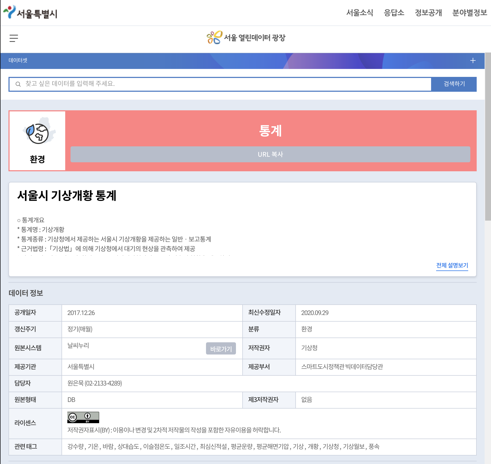
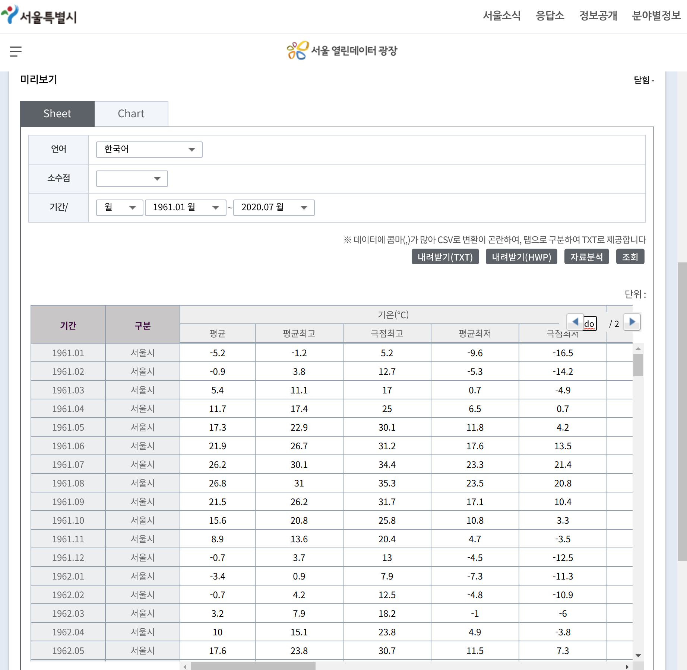
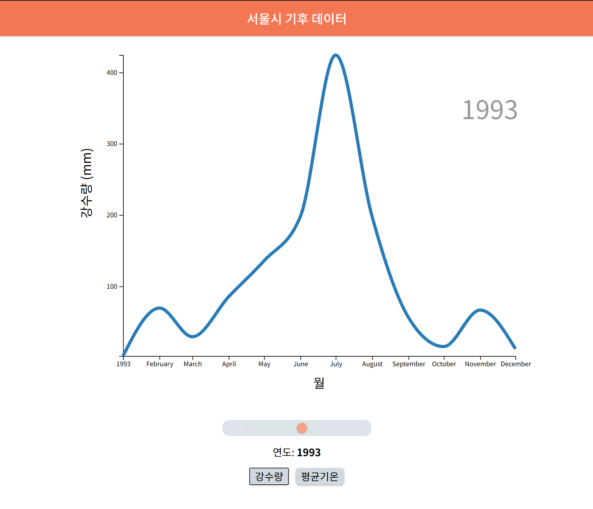

#### 들어가며

프론트엔드의 꽃은 데이터를 어떤 식으로 시각화해 보여주느냐인 것 같다. 여러 차트 라이브러리가 있긴 하지만, 역시 가장 강력한 툴은 svg를 자유자재로 다루는 d3가 아닌가 싶다. 오늘은 d3.js를 이용해서 서울시 강수량 그래프를 구현해보도록 하겠다.

결과물은 다음 페이지에서 확인할 수 있다.

[https://svelte-weather.huskyhoochu.vercel.app/](https://svelte-weather.huskyhoochu.vercel.app/)

#### 데이터

데이터는 [서울시 열린데이터 광장](https://data.seoul.go.kr/dataList/414/S/2/datasetView.do) 에서 <서울시 기상개황 통계>를 이용했다. 1961년 1월부터 2020년 7월까지의 주요 기상 지표를 보여주는 규모가 큰 데이터셋이다.





이렇게 해서 무려 40년치의 강수량 데이터를 확보했다. 필자는 txt파일의 데이터가 탭 기준으로 정렬되어 있다는 점에 착안하여 확장자를 tsv로 바꾼 뒤 데이터 가공을 수행했다. 데이터 가공은 여러분이 자신만의 방식으로 자유롭게 해도 상관없다고 생각한다.

#### 그래프 그리기

그래프 그리기는 총 4가지 단계를 거쳐 이루어진다.

1. 캔버스 그리기
2. 스케일 만들기
3. 라인 그리기
4. x축, y축 그리기

###### 캔버스 그리기

캔버스 그리기는 간단하다. html 상에서 뿌리가 되는 엘리먼트를 하나 선택한 뒤 그 내부에 svg를 삽입하면 된다.

```javascript
const dimensions = {
  width: window.innerWidth * 0.8,
  height: 600,
  graphWidth: 0,
  graphHeight: 0,
  margin: {
    left: 100,
    right: 30,
    top: 30,
    bottom: 100,
  },
};

dimensions.graphWidth =
  dimensions.width - dimensions.margin.left - dimensions.margin.right;
dimensions.graphHeight =
  dimensions.height - dimensions.margin.top - dimensions.margin.bottom;

// canvas
let svg = d3
  .select('#wrapper')
  .append('svg')
  .attr('width', dimensions.width)
  .attr('height', dimensions.height)
  .style('display', 'block')
  .style('margin', '0 auto');

const rootGroup = svg
  .append('g')
  .attr(
    'transform',
    `translate(${dimensions.margin.left}, ${dimensions.margin.top})`,
  );
```

`dimension`은 앞으로 그래프를 구현하기 위해 사용할 너비와 높이, 마진에 대한 정보를 기록한 객체이다.

`svg`는 html에 존재하는 `#wrapper` 엘리먼트를 선택해 svg 요소를 생성한 것이다.

`rootGroup`은 `svg`의 내부에 전체 그래프 요소의 부모격이 되는 그룹('g')를 생성한 것이다.

###### 스케일 만들기

스케일이란 비유하자면 지도의 축적과 같은 것이다. 우리가 표현하려는 데이터의 범위가 얼마나 크든 혹은 작든지, 그래프로 표현할 때는 반드시 캔버스가 표현할 수 있는 픽셀의 범위 안에서만 이루어져야 한다. 그래서 우리가 넣으려는 입력값과 출력되기 원하는 출력 데이터의 범위를 스케일을 통해 설정하는 것이다.

입력값은 `domain`이라는 함수로, 출력값은 `range`라는 함수로 입력할 수 있다.

```javascript
// scales
const timeParser = d3.timeParse('%Y.%m'); // 시간 데이터를 d3가 이해하도록 설정해주는 내장 함수
const xAccessor = d => timeParser(d.time); // timeParse 함수로 데이터를 감싼다

const xScale = d3
  .scaleTime()
  .domain(d3.extent(yearData, xAccessor)) // domain: 입력값의 범위 [최소값, 최대값]
  .range([0, dimensions.graphWidth]); // range: 출력값의 범위 [최소값, 최대값]

const yScale = d3
  .scaleLinear()
  .domain(d3.extent(yearData, yAccessor))
  .range([dimensions.graphHeight, 0]); // <-- yScale은 예외적으로 범위를 뒤집는다.
// [최소값, 최대값]으로 입력하면 그래프가 뒤집혀 출력되기 때문이다
```

xScale의 경우 시간 축을 입력해야 하는데, 우리 데이터셋의 시간이 '2020.01'의 형식으로 입력되어 있으므로 d3 내장함수로 데이터가 시간 값으로 입력되고 있음을 알려줘야 한다.

`domain`과 `range` 모두 `[최소값, 최대값]`의 배열 형태로 입력되어야 한다. `d3.extent`는 첫 인자에 데이터셋을 넣고 두 번째 인자에 미리 정의한 accessor 함수를 넣으면 최대값과 최소값을 자동 생성해주는 함수이다.

`domain`은 데이터의 최소값과 최대값을, `range`는 우리가 그래프를 출력할 캔버스의 픽셀 범위를 입력해 준다.

`yScale`의 `range` 값을 뒤집어 입력하는 이유는 아직 다 이해하진 못했다. 다만 그대로 입력하면 그래프가 뒤집어 출력된다는 점만 알았을 뿐이다...

#### 라인 그리기

```javascript
// line
const lineGenerator = d3
  .line() // 라인을 그린다
  .x(d => xScale(xAccessor(d))) // 각 포인트의 x 좌표
  .y(d => yScale(yAccessor(d))) // 각 포인트의 y 좌표
  .curve(d3.curveMonotoneX); // 곡률 스타일 설정

// Join new data
const line = rootGroup
  .selectAll('.lineTest') // 가상선택자 선택
  .data([yearData], yAccessor) // 데이터 주입
  .enter() // 가상선택자 생성 시작
  .append('path') // 가상 path 엘리먼트 생성
  .attr('class', 'lineTest') // path 엘리먼트에 아까 입력한 class를 입력함으로써 전체 선택을 활성화
  .attr('d', lineGenerator(yearData)) // 라인 생성
  .attr('fill', 'none') // 라인을 말 그대로 선만 남기기 위해 너비 영역을 색칠하지 않게 함
  .attr('stroke', '#137CBD') // 선 색칠
  .attr('stroke-width', '5px'); // 선 두께 설정
```

스케일을 만들었으니 이제는 스케일을 이용해 라인을 만들 차례다. `lineGenerator`에서 라인에 대한 요건을 정의하고 `line`에서 실제로 라인을 그리도록 한다.

#### x축, y축 그리기

마지막으로 축을 그린다. 아까 만든 스케일을 다시 활용해 스케일을 만들 것이다.

```javascript
const xAxisGenerator = d3.axisBottom().scale(xScale);

const yAxisGenerator = d3.axisLeft().scale(yScale).ticks(5); // tick: 눈금 갯수

const xAxis = rootGroup
  .append('g')
  .attr('class', 'x-axis')
  .attr('transform', `translate(0, ${dimensions.graphHeight})`) // x축을 바닥으로 내리기 위한 설정
  .call(xAxisGenerator);

const yAxis = rootGroup
  .append('g')
  .attr('class', 'y-axis')
  .call(xAxisGenerator);
```

각 generator로 축에 대한 요건을 정의하고 실제로 엘리먼트를 생성하는 각 축에서 그것을 `call` 하면서 축을 그려낸다.

#### 실제 모습

완성된 그래프는 다음과 같다. 실제 코드는 좀더 세팅을 해서 연도별 그래프의 변화를 애니메이션으로 보여주고 있으니 사이트에서 확인하기 바란다.



결과물은 다음 페이지에서 확인할 수 있다.

[https://svelte-weather.huskyhoochu.vercel.app/](https://svelte-weather.huskyhoochu.vercel.app/)

github 주소는 다음과 같다.

[https://github.com/huskyhoochu/svelte-weather](https://github.com/huskyhoochu/svelte-weather)

실제 프로젝트는 svelte를 이용해 개발했는데 이 포스트에선 svelte에 대한 이야기를 일부러 생략했다. svelte에 대한 내용은 다음 포스트에서 다뤄보도록 하겠다.

d3 개발은 정말 멀고 험난하기 때문에 이번에는 기초 중의 기초만 성공했다는 느낌이다. 차차 개선할 수 있기를...
