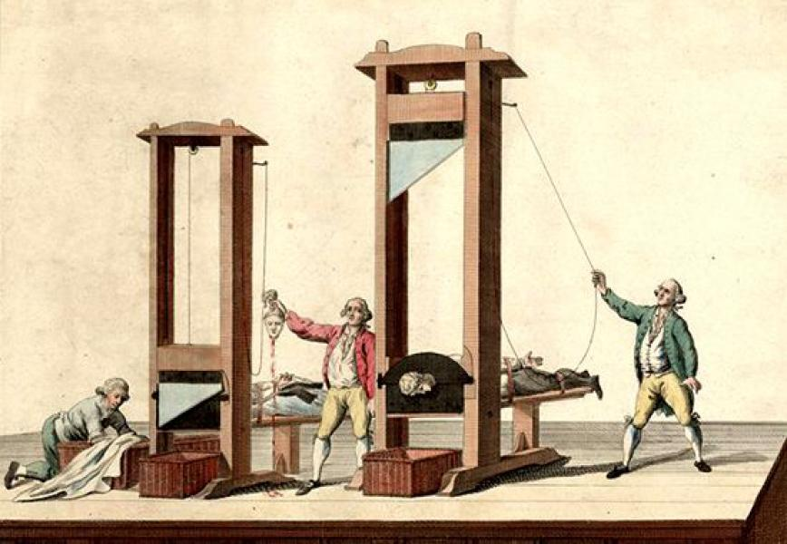
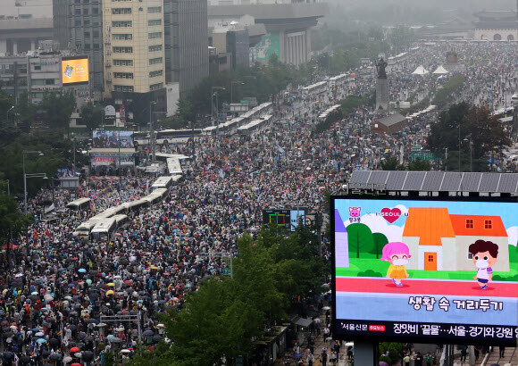

#### 100자 평

> 토크빌의 저서 <미국의 민주주의>를 분석한 작품. 미국은 어떻게 민주주의를 세웠고 역사상 가장 성공적인 민주주의 모델을 만들 수 있었는지를 돌아보는 내용. 평소에 잘 모르던 미국의 대통령 선거 방식이나 상원/하원의 역할 등을 확인할 수 있어 유익했다.

#### 유럽의 용광로를 벗어난 변두리에서 가장 위대한 민주주의가 탄생한 비결

미국, 이라는 나라는 한국식 명칭으로는 그 본질을 바라보기 어렵다. 이 나라의 정식 명칭은 United States of America, 즉 아메리카 합중국이다. 50개의 서로 다른 나라가 하나의 연방으로 작용하고 있는 느슨한 연합체인 것이다. 이 나라의 독특한 정치 체계를 중앙집권적 관료체제에 익숙해져 있는 아시아 사람이 이해하기란 쉽지 않다. 당장 대통령 선거를 어떤 식으로 하는지도 선거 철마다 새로 배워야만 하니까. <미국의 민주주의를 읽다>는 양자오라는 중국 인문학자의 서양 고전 읽기 시리즈의 하나로 19세기 저서인 토크빌의 <미국의 민주주의>를 21세기 아시아 인의 눈으로 해설해주고 있는 작품이다. 저자는 이 저서를 통해 프랑스와 미국의 당시 정치적 상황을 비교하면서 어째서 대혁명을 일으킨 프랑스보다도 유럽의 변두리에서 출발한 신생국이 역사상 가장 위대한 민주주의를 꽃피웠는지를 설명한다.

미국의 정치권력은 "각 주 분권제"라는 독특한 시스템으로 분배되어 있고, 이것이 핵심이다. 미국은 가장 기본적인 정치 단위를 시민 개개인이 아닌 "주(state)"로 보고 있으며 이것이 삼권 분립 체제에 고스란히 반영되어 있다.

###### 상 / 하원의 설계 방식

미국의 의회는 상원과 하원으로 나뉘는데, 이들의 권력은 분명한 의도를 갖고 분배되어 있다. 법안을 만들고 발의하는 하원은 인구 비례에 따라 구획된 선거구에서 일정한 비율로 선출되지만 법안을 승인하고 올바로 시행되는지 감독하는 상원은 인구 규모에 상관 없이 모든 주가 두 명씩을 선출한다. 따라서 법안 발의는 인구 비례에 따른 수요가 반영되지만 법안이 승인될 때에는 가장 큰 주에서 가장 작은 주에 이르기까지 모든 주의 의견이 동등한 비중으로 반영된다.

###### 대통령 선거인단

모든 시민이 직접 대통령을 투표하는 것까지는 보통의 직접 선거와 다를 바 없지만, 미국의 대통령 선거에는 '선거인단'이라는 제도가 끼어 있다. 미국 연방 대통령은 시민이 직접 투표하는 게 아니라 주 대표로 선출된 선거인단의 투표로 이루어진다. 이 선거인단은 실제 사람이 아니라 투표 결과에 따라 만들어지는 가상의 인물들인데, 어떤 주에서 승리한 후보가 선거인단 전체의 표를 가져간다는 규칙에 따라 움직인다. 이 규칙은 예측하지 못한 부작용을 일으키기도 한다. 가령 미시시피 주에서 트럼프와 힐러리가 대결을 펼쳤는데 트럼프 51표, 힐러리 49표라는 결과가 나왔다고 치자. 간신히 과반수를 넘겨서 승리한 상황이고 만일 연방 대통령이 직접 선거로 선출되는 시스템이라면 설령 트럼프가 승리했더라도 힐러리의 49% 득표율이 무거운 비중으로 다가왔을 것이다. 하지만 연방 대통령은 선거인단의 투표로 이루어지며, 미시시피 주에서 트럼프가 승리했다면 그 표차에 상관 없이 모든 선거인단의 표를 트럼프가 독점하게 된다. 49%에 달하는 힐러리 지지자의 표가 모두 무산되는 셈이다. 이 역전극이 극단적인 상황으로 치달으면 전체 득표율에서 앞서더라도 실제 선거인단 투표에서 패배하는 일도 생기게 된다. 최근 트럼프가 당선된 선거에서 같은 일이 일어났었고, 세계인들은 의문을 표했다. 국민의 실제 득표가 무시되는 이런 시스템을 유지하는 것이 옳은가? 그러나 선거인단 제도는 미국 정치의 정체성을 드러내는 가장 대표적인 제도이므로 사라질 일은 없을 것이다. 연방 대통령은 미국의 지배자가 아니다. 대통령은 실질적인 지도자인 각 주의 이해관계를 교섭하고 외교를 담당하는 실무자일 뿐이다. 따라서 대통령은 50개의 주가 각 주의 이름으로 선출해야만 하는 것이다.

###### 독립된 사법권을 갖는 주지사

미국 정치의 본질은 50개의 개별 국가가 주(state) 라는 이름으로 연방을 이루고 있다는 데에 있으며, 이 본질을 실질적으로 뒷받침하는 것이 독립된 사법권이다. 각 주는 개별적인 행정 및 사법 시스템을 가지며, 같은 범죄를 놓고도 제각기 다른 형량을 부과하며 사형 제도 또한 각 주에서 개별적으로 운영한다. 각 주의 최고 법정이 내린 판결을 연방은 간섭할 수 없으며, 어떤 사형수의 사면 권한 또한 해당 주의 주지사만이 가지며 연방 대통령이 결정에 개입하는 것은 불가능하다.

대혁명 이후로도 혼란의 가시밭길을 걷고 있는 프랑스의 현실을 개탄하며 관료 귀족 출신인 토크빌은 당시 신흥국인 미국으로 떠나 그곳의 감옥 행정을 조사한다. 그 과정에서 토크빌은 미국 민주주의의 저력을 발견하게 되고 프랑스로 돌아와 민주주의 실현에 실패한 프랑스 사회에 미국을 배워야 한다고 끊임없이 설득하게 된다. 그 결과물 중 하나가 <미국의 민주주의> 라는 책이다.

미국의 민주주의가 성공한 비결은 무엇일까? 신대륙이라는 조건이 모든 이주민이 평등하게 출발할 수 있는 기회를 제공해 줬고, 청교도라는 금욕주의적인 종교가 개인의 자유를 제한하는 엄격한 사회를 만들어내는 데 효과적인 역할을 했기 때문이다. 그 결과 미국은 '중간의 사회'를 창출해내게 되었다. 중간의 사회란 귀족주의 사회에서 특권 계층이 독점하던 존엄과 사치를 모든 구성원이 조금씩 나눠가지는 것을 말한다. 이 사회에서는 사회적 자산을 독점하는 데서 오는 즐거움이 줄어드는 대신 모든 구성원이 비슷한 생활을 영위하는 데서 오는 편안함이 증가한다. 예술이나 과학을 찬란하게 발전시킬 수는 없지만 모든 시민이 동등한 수준의 교양을 쌓을 수 있는 기회를 제공하게 된다. 귀족주의 사회에 비해 사람들의 개별적인 불만은 늘어나겠지만 사회 근간을 흔드는 치명적인 범죄는 줄어들게 된다.

토크빌이 친구에게 보낸 편지를 보면 그가 인식한 민주주의가 어떤 성격을 지니는가를 엿볼 수 있다.

> 88P. 민주주의를 반대하는 저 사람들, 민주주의가 바로 파괴, 혼란, 모살, 횡령이라고 여기는 저 사람들에게 알려 주고 싶네. 민주주의에는 자체의 고귀한 점이 있는데, 그 고귀는 그들이 이해하고 있는 고귀와 아주 다르다는 사실을 말이야. 민주주의의 고귀는 모든 사람이 약간의 고귀와 약간의 존엄을 지니도록 하는 것이지, 극소수의 사람이 모든 고귀와 존엄을 차지하는 것이 아니라네...... 그들이 좋아하든 말든 이 세계는 갈수록 평등해지고 민주적인 방향으로 발전하고 있음을 그들이 이해하기를 바라네.

#### 자유, 평등, 박애를 부르짖은 대혁명은 왜 실패했는가

그렇다면 미국에 앞서 귀족 사회를 무너뜨리려 했던 프랑스 대혁명은 왜 실패했을까? 어째서 혁명 직후에 나폴레옹 황제를 집권시키고 절대 왕정의 길로 되돌아간 것일까? 토크빌은 프랑스 시민이 갈망했던 무제한의 자유를 위해서는 그만큼 효율적이고 유능한 정부를 필요로 하며, 유능한 정부는 다시 거꾸로 개인의 자유를 제한하게 된다는 모순을 받아들이지 못했기 때문이라고 설명한다. 혁명 전까지 프랑스는 귀족 관료를 중심으로 작동하는 중앙집중 정부를 운영하고 있었지만 혁명 세력이 이들 모두를 숙청해버리면서 시민 계급은 관료 시스템을 운영할 지식의 고리를 스스로 끊어버리고 만다. 그 결과 무능한 괴뢰 정부가 세워지고, 다시 그 정부를 숙청하는 피비린내 나는 혼란이 빚어지게 된 것이다.

반면 미국은 인간이 누려야 할 자연적 자유와 정부로부터 원칙에 따라 보장받아야 할 시민적 자유가 서로 분리되어 있음을 이해하고 있었다. 미국 독립 혁명 당시 미국인은 영국으로부터 본질적인 해방을 원했다기보단 영국 시민과 동등한 세금을 징수한 만큼 동등한 의회 대표를 선출하기를 요구했다. 그렇다면 미국 시민들은 어떻게 시민적 자유를 이해하고 있었을까? 그들의 청교도적 세계관을 들여다보면 쉽게 수긍할 수 있다. 토크빌이 인용한 미국 독립 혁명 당시 어떤 선교사의 글을 보자.

> 156P. "우리는 영국으로부터 어떤 자유를 원하는가? 예수 그리스도가 우리에게 준 것과 같은 자유다."

"예수 그리스도가 준 자유" 란 본래적인 것이 아닌 윤리적으로 새롭게 정의된 자유다. 모든 것을 마음대로 할 수 있는 자유가 아니라 죄를 짓지 않을 자유, 규범을 실천했을 때 구원받을 수 있는 자유다. 방탕한 가톨릭 교회의 면죄부를 구입해 얻는 자유와는 질적으로 다른 것이며 프랑스 대혁명이 얻어내려고 했던 무제한의 자유와도 다른 것이다. 미국 시민 공동체는 이런 자유에 대한 이해가 전제되어 있었기에 자신들의 국가를 세울 때에도 개인의 방탕한 자유를 스스로 제한하고 공공의 이익을 늘리는 민주주의를 구성할 수 있었다.

#### 민주주의는 혁명이 아니라 공감에서 온다

책은 프랑스 혁명과 미국 독립 혁명의 질적 차이를 비교하면서 마무리된다. 그 중 인상깊었던 소제목은 '민주주의는 혁명이 아니라 공감에서 온다'는 것이었다. 결국 혁명이 끝난 뒤에 새로운 질서를 세우기 위해서는 모든 구성원 간의 이해와 공감이 필수적이라는 이야기였다.

구성원 간의 동질성, 개인의 자유를 공공의 이익과 맞바꿀 수 있는 도덕성과 용기, 아래로부터 만들어지는 자치적 권력 구조. 미국이 민주주의를 만들어낼 수 있었던 원료는 이런 것들이었다. 이제 결말에 이르러 진부한 비교를 해야 할 때가 왔다. 과연 우리는 어떤가? 코로나 시대에 이르러 민주주의는 다시 한번 새로운 시험대에 올랐다. 디지털 정보로 개인의 동선을 파악하는 사회에서 누군가는 기꺼이 자신의 자유를 내어놓지만 누군가는 집회의 자유, 기본권을 열망하면서 사회를 새로운 혼란의 도가니로 몰아넣는다. 하지만 결국 이 제각각인 사람 모두를 탄압하기보다는 '중간의 선함, 중간의 이상'으로 끌고 가는 것이 민주주의의 역할이 아닌가 싶다. 그 점에서 현 정부의 원칙주의는 신뢰가 간다. 그러면서도 코로나 이후의 시대에서 우리가 얼마나 제대로 적응해 살아남을 수 있을지는 불안하고 막막하다.

