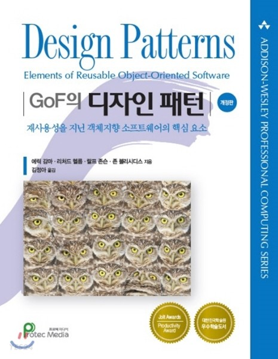
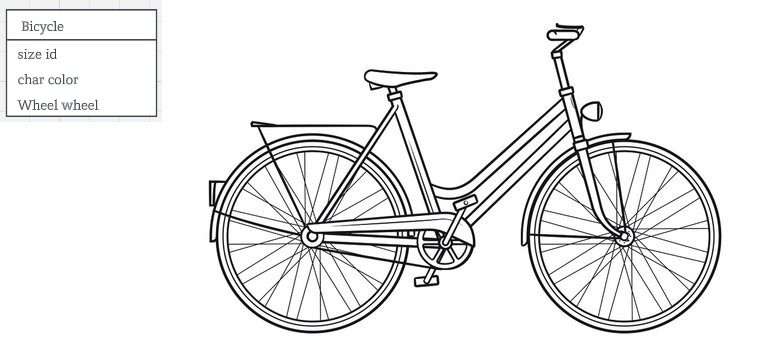

#### 디자인 패턴은 나의 코드를 공용어로 만들어 준다

초보 개발자 시절, 읽을 만한 책을 찾고자 (코딩 연습을 덜 하려는 핑계로) 서점을 돌아다니다가 아주 재미없게 생긴 책을 발견한 적이 있었다. 지금이야 이 책의 진가가 어마어마하다는 사실을 알고 있지만 당시에는
펼치기만 하면 스르륵 잠이 드는 마법의 책 쯤으로 생각했었는데, 바로 그 유명한 GoF 책이었다.



[알라딘: GOF의 디자인 패턴](https://www.aladin.co.kr/shop/wproduct.aspx?ItemId=56051596)

시간이 흘러 다시 읽어보니, 그동안 디자인 패턴을 공부하려고 읽었던 다른 수많은 얄팍한 책들보다 훨씬 깊이 있고 세세한 내용을 다루고 있었다. (그 모든 책들이 기본적으로 인용하고 있는 교과서에 가까운 책이기도
하고) 여전히 여기서 말하는 패턴의 본질과 정수를 깔끔하게 설명하기는 어렵지만, 지금 시점에서 '디자인 패턴이란 무엇인가? 왜 써야 하는가?' 라는 질문을 받는다면 이런 답변을 남길 수 있을 것 같다. **디자인
패턴은 소프트웨어 개발 중에 발생하는 문제를 해결해주는 유형화된 해답이며, 패턴에 숙련될수록 나의 코드는 다른 개발자가 이해하기 쉽고 재사용하기 편리해진다.** 디자인 패턴이란 객체지향 설계 패러다임 안에서
개발자들을 한데 묶어주는 공용어라고 볼 수 있으며, 초보 개발자를 한 단계 성장하게 도와주는 단단한 계단과 같은 역할을 해준다.

###### 기술적 설명: 디자인 패턴이란

모든 객체는 자율성을 가지며 서로 다른 객체와 함께 협력하여 주어진 문제를 해결해 나간다. 여기서 '자율성'과 '협력'이라는 키워드에 주목해 보자. 개발자가 시키는 대로 행동할 뿐인 명령어 덩어리인 코드를 왜 살아
있는 생물체처럼 취급하는 것일까? '객체'를 현실세계의 사물이라고 상상하면 코딩하기에 편리해서? 간혹 그런 식으로 설명하는 문헌이 있기도 하지만, 객체와 사물은 엄연히 다른 존재일 수밖에 없다. '
Bicycle'이라는 객체는 실행되는 순간 스스로 굴러가지만 현실의 '자전거'는 사람이 올라타지 않으면 영원히 제자리에 서 있게 된다. 둘의 공통점은 개발자가 정의내린 '상태'와 '행위'들이 전부다. 어떤 타이어를
쓰는지, 기름칠은 되어 있는지, '달리는' 행위를 하는지 등등의 것들 말이다.



객체를 자율성을 지닌 존재, 협력하는 존재로 취급하는 이유는 그것들이 단순히 현실의 존재와 닮았기 때문이 아니라 개발자가 정의한 '객체의 상태와 행위'를 전역 환경으로부터 독립시켜 취급하기를 바라기 때문이다. 상태가
환경의 간섭을 받지 않고 자신의 기능을 자율적으로 처리하며, 다른 객체를 간섭하지 않고 협력하여 최종 결과물을 만들어가는 것. 이것이 객체지향 설계가 바라는 핵심 목표인 것이다.

디자인 패턴은 여러 개발자가 비슷한 문제를 맞닥뜨렸을 때 비슷한 형태로 해결했던 노하우를 집약시켜놓은 결과물이다. GoF는 Gang of Four 라고 불리는 에리히 감마(Erich Gamma), 리처드 헬름(
Richard Helm), 랄프 존슨(Ralph Johnson), 존 블리시데스(John Vlissides)라는 개발자가 쓴 디자인 패턴 해법 책이다.

###### 디자인 패턴의 세 가지 범주

저자가 정의한 디자인 패턴은 크게 세 가지로 나뉜다. 객체를 생성하는 데 사용되는 생성 패턴(Creational Patterns), 객체 간의 관계성을 맺게 할 때 쓰이는 구조 패턴(Structural
Patterns), 객체의 역할과 책임을 분배할 때 쓰이는 행동 패턴(Behavioral Patterns). 각 패턴은 다시 여러 개의 세부 패턴으로 나뉘게 되는데 전체 목록은 다음 페이지에서 확인해볼 수 있다.

참조: [디자인 패턴들: Refactoring Guru](https://refactoring.guru/ko/design-patterns)

#### 팩토리 메서드 패턴: 어떤 객체를 생성해야 할지 모를 때, 생성 책임을 서브클래스에게 위임하자

오늘 예시로 들어볼 패턴은 생성 패턴 가운데 하나인 팩토리 메서드 패턴이다. 먼저 '팩토리'가 무엇인지 알아보자. 팩토리는 최종적으로 원하는 객체를 생성하기 위한 로직을 캡슐화한 부모 클래스를 말한다. 실제
클라이언트 환경에서 객체를 생성하기 위해 일일이 로직을 펼쳐놓는 것보다 팩토리 객체를 통해 생성하는 편이 훨씬 유연한 코드를 작성하기 쉽다.

그런데 클라이언트에서 최종적으로 어떤 타입의 객체를 필요로 하는지 모르는 경우가 있을 수 있다. 여러분이 배달의민족에서 피자 가게를 운영한다고 가정해보자. 손님이 페퍼로니 피자를 주문할지, 슈퍼슈프림 피자를
주문할지, 하와이안 피자를 주문할지는 주문이 실제로 들어올 때까지 어플리케이션이 알지 못한다. 이때 팩토리 객체가 객체 생성을 관장하여 개별 피자의 생성자를 호출해준다.

###### 코드 데모

참조: [팩토리 메서드 패턴: 위키백과](https://ko.wikipedia.org/wiki/%ED%8C%A9%ED%86%A0%EB%A6%AC_%EB%A9%94%EC%84%9C%EB%93%9C_%ED%8C%A8%ED%84%B4)

```javascript
//Our pizzas
function HamAndMushroomPizza() {
  var price = 8.5;
  this.getPrice = function () {
    return price;
  };
}

function DeluxePizza() {
  var price = 10.5;
  this.getPrice = function () {
    return price;
  };
}

function SeafoodPizza() {
  var price = 11.5;
  this.getPrice = function () {
    return price;
  };
}

//Pizza Factory
function PizzaFactory() {
  this.createPizza = function (type) {
    switch (type) {
      case 'Ham and Mushroom':
        return new HamAndMushroomPizza();
      case 'DeluxePizza':
        return new DeluxePizza();
      case 'Seafood Pizza':
        return new SeafoodPizza();
      default:
        return new DeluxePizza();
    }
  };
}

//Usage
var pizzaPrice = new PizzaFactory().createPizza('Ham and Mushroom').getPrice();
alert(pizzaPrice);
```

여기서 `createPizza` 함수가 '팩토리 메서드'라고 오해해서는 안 된다.
이건 [용어가 잘못 만들어진 데에서 온 오해](https://ko.wikipedia.org/wiki/%ED%8C%A9%ED%86%A0%EB%A6%AC_%EB%A9%94%EC%84%9C%EB%93%9C_%ED%8C%A8%ED%84%B4)
다. 팩토리 메서드 패턴은 템플릿 메서드 패턴의 생성 패턴 버전이라고 보는 편이 더 정확하다.

###### 템플릿 메서드 패턴?

템플릿 메서드 패턴은 부모 클래스가 서브 클래스의 형태를 정의할 수 있도록 표준 기능들을 미리 갖추어 놓는 행동 패턴을 말한다. 피자 가게를 예로 들면, 피자가 만들어지는 과정을 추상 클래스로 정의해두고 구상
클래스가 그 내용을 상속받는 것이라고 생각하면 좋다.

```typescript
abstract class Pizza {
  public templateMethod(): void {
    this.makeDow();
    this.spreadTopping();
    this.bakePizza();
    this.addSource();
  }

  protected makeDow(): void {
    console.log('도우를 만듭니다');
  }

  protected spreadTopping(): void {
    console.log('토핑을 뿌립니다');
  }

  protected bakePizza(): void {
    console.log('피자를 굽습니다');
  }

  protected abstract addSource(): void;
}

class CheezePizza extends Pizza {
  protected addSource() {
    console.log('치즈피자에는 A 소스를 뿌립니다');
  }
}

class HawaianPizza extends Pizza {
  protected addSource() {
    console.log('하와이안 피자에는 B 소스를 뿌립니다');
  }
}

function clientCode(pizza: Pizza) {
  pizza.templateMethod();
}

clientCode(new CheezePizza());

clientCode(new HawaianPizza());
```

해당 템플릿 메서드 패턴에서는 피자를 만들기 위해 도우를 만들고, 토핑을 뿌리고, 피자를 굽는 기본 행위를 추상 클래스를 통해 공통 정의해 놓고, 개별 피자 클래스마다 소스를 뿌리는 행위만 개별적으로 구현하고 있다.
그래서 피자가 구현될 때 기본 과정의 명령 중복 없이, 하나의 인터페이스 안에서 각각의 피자를 깔끔하게 구현해낼 수 있게 된다.

팩토리 메서드 패턴은 템플릿 메서드가 생성자를 만들어내도록 은닉되어 있는 상태로 생성 패턴화된 것이라고 생각하면 될 것이다.

#### 마치며: 패턴은 외계어가 아니라 레시피다

디자인 패턴을 마냥 어렵고 막연한 것이라 생각했던 분들이 계시다면, 오히려 책을 먼저 보기보단 자신의 코드를 돌아보는 걸 추천한다. 이미 어디서 배우지도 않았는데 디자인 패턴 중 하나와 유사한 코드를 제작한 경험이
있을지도 모른다. 그럼 거기서부터 다시 책으로 돌아가 나의 코드와 정석 패턴의 공통점과 차이점을 찾아보고, 정석 패턴으로 리팩토링했을 때 내 코드가 얼마나 더 나아지는지 확인해본다면 분명 패턴은 코드를 우아하게
만들어주는 요리 레시피처럼 다가오게 될 것이라 생각한다.
