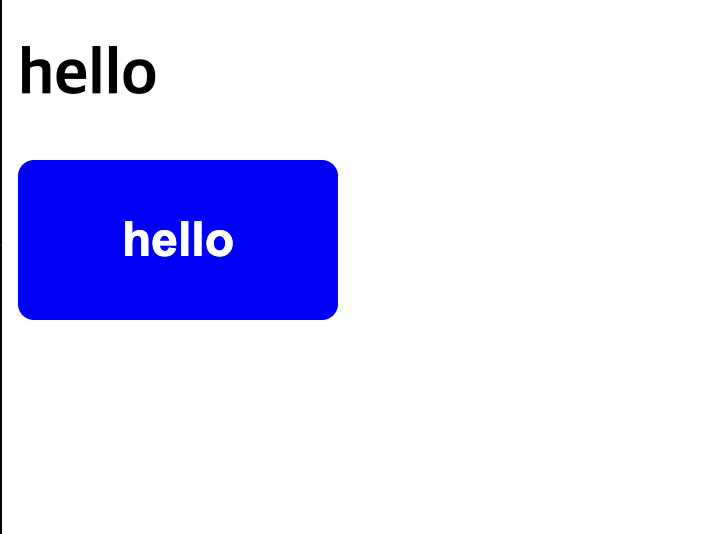
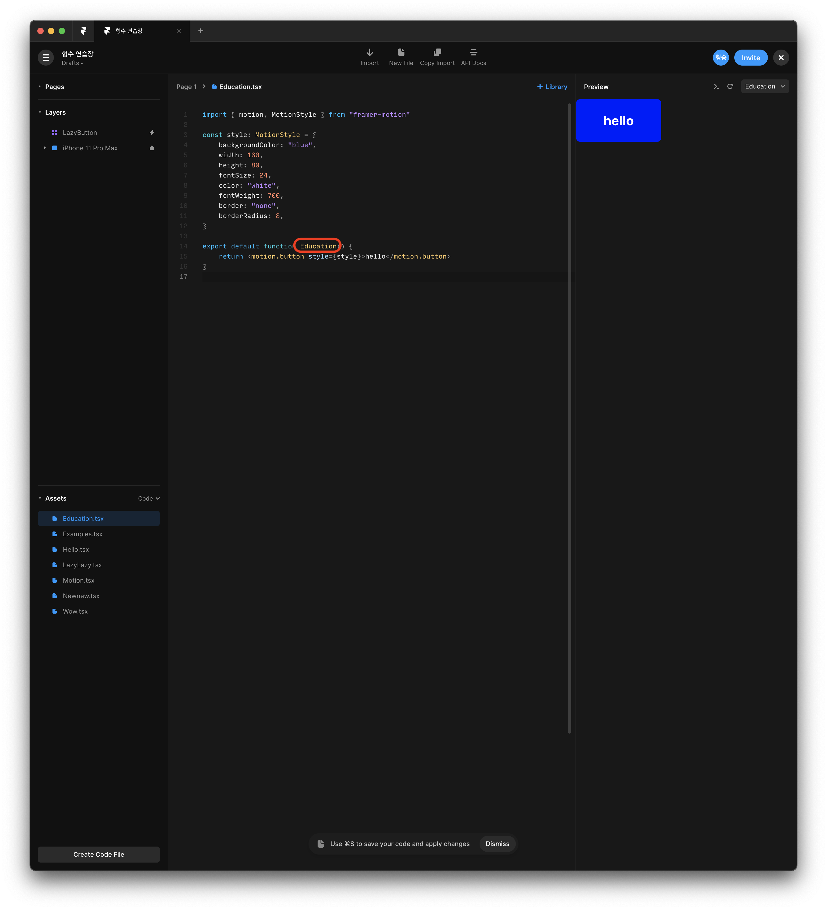
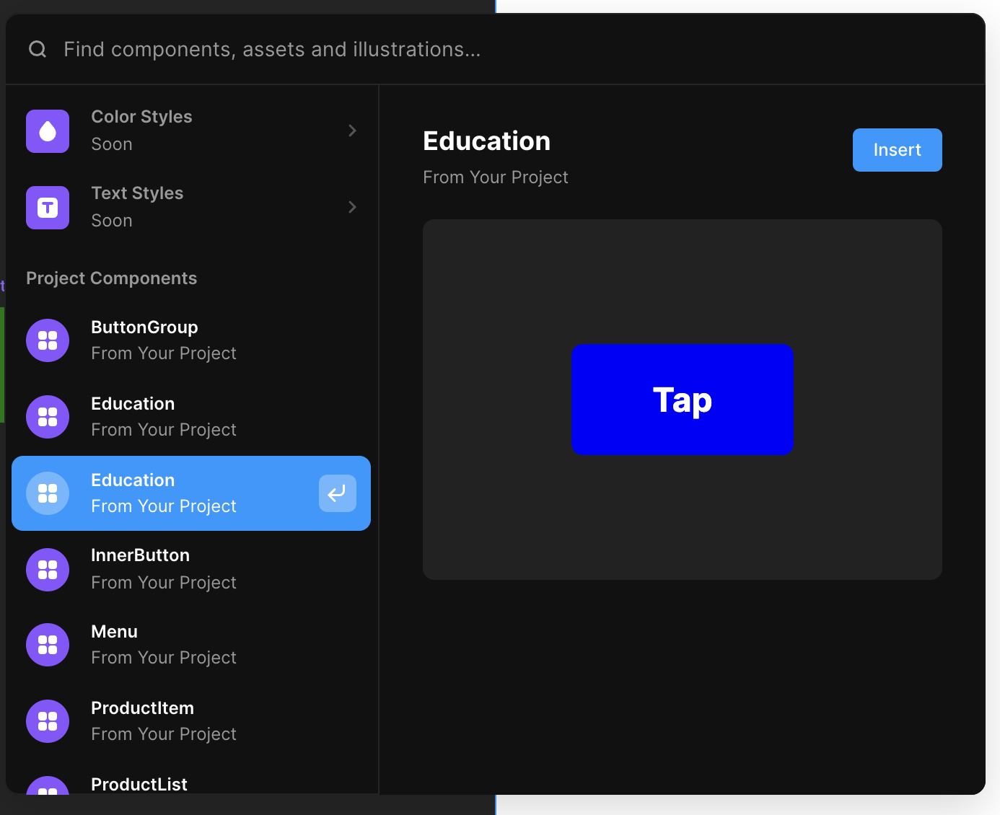

#### 들어가며

- [framer](https://www.framer.com/) - React 컴포넌트를 이용해 웹 프로토타이핑을 실현하는 도구
- [framer-motion](https://www.framer.com/motion/) - Framer에서 제작한 컴포넌트를 그대로 코드에 삽입할 수 있게 해 주는 라이브러리

###### 프로토타이핑과 퍼블리싱의 불연속성에서 오는 한계

Adobe XD, Figma 등등 훌륭한 프로토타이핑 툴은 시중에 많이 나와 있다. 하지만 개발자에게 있어 프로토타이핑 툴은 어떤 한계를 지니고 있는 것으로 느껴진다. 디자이너가 아무리 훌륭하게 디자인을 해 줘도, 개발자가 퍼블리싱하는 과정에서 필연적으로 오차가 발생하기 마련이다. 결국 그림에서 코드로 디자인을 옮기는 건 사람의 눈이기 때문이다. Zeplin 같은 툴이 디자이너의 결과물을 CSS 코드로 뽑아주기도 하지만 그마저도 퍼블리싱에 그대로 대입하기란 쉽지 않다.

여기에 덧붙여서 프론트엔드 개발자에겐 또다른 문제들이 쌓여 있다. 우선 프로토타입에서는 하나의 덩어리로 완성되어 있는 화면의 각 요소를 재활용 가능한 컴포넌트로 분할해야 하는 과제가 있다. 더 나아가서는 프론트엔드 전반에 걸쳐 일관된 디자인 문법으로 사이트를 설계할 수 있도록 디자인 시스템을 설계해야 하는 과제가 있다. 이번에도 프로토타입을 컴포넌트로 옮겨 작성하려면 개발자의 눈썰미에 많은 것을 의존해야 한다.

###### 프로토타이핑 결과물을 그대로 퍼블리싱에 사용할 순 없을까?

만일 위의 제목대로, 프로토타이핑 결과물을 재작성하지 않고 연속적으로 재활용하는 게 가능하다면 업무 생산성 및 퀄리티는 크게 향상될 것이다. 뭂론 그런 건 불가능하다고 생각했었다. 프레이머를 만나기 전까지는 말이다.

프레이머는 프로토타이핑 -> 퍼블리싱이라는 작업흐름을 코드 -> 프로토타이핑으로 뒤집어버림으로써 문제를 해결했다. 즉, React 컴포넌트를 입력하면 그것이 프로토타이핑 결과물이 되는 것이다. 이로써 React 코드를 작성할 줄만 안다면 누구든 프로토타이핑을 해낼 수 있고, 개발자는 이미 작성된 컴포넌트를 그대로 활용하는 것이 가능해진다. 물론 코드 없이 기존의 방식으로도 프로토타이핑을 하는 것이 가능하다. 다만 이 경우에는 소프트웨어에 사용된 효과를 그대로 재현할 수 있도록 프레이머에서 npm 패키지를 제공해 준다.

###### 코드로 소통하기 - 디자이너에게 새로운 부담이 되지 않을까?

물론 프레이머의 방식도 완벽한 해결책은 아니다. 코드를 이용한 프로토타이핑이 가능하다는 건, 디자이너가 코드로 프로토타이핑을 해줄 수 있을 때 의미를 가질 것이다. React 코딩이 가능한 디자이너가 얼마나 될 것인가? 그게 불가능해서 기존의 방식으로 프로토타이핑을 한다면, 개발자 중의 누군가가 그것을 다시 한번 코드로 된 프로토타이핑 형태로 재작성하는 비효율을 겪어야 할 것이다. 이 문제를 해결할 수 있는 방법이 있을까? 그건 여전히 물음표이긴 하다. 어쨌거나 프레이머는 디자이너가 구상한 배치 및 효과를 가장 근접하게 재현할 수 있도록 도와주는 프로토타이핑 툴임이 확실해 보인다.

#### 실습하기

###### framer-motion 컴포넌트 제작

React가 설치된 프로젝트를 준비한다. 그 다음 framer-motion 패키지를 설치한다.

```shell
yarn add framer-motion
```

예시는 Next.js 환경에서 실습을 수행한다고 가정한다.

```tsx
// src/framers/button.tsx

import React from 'react';
import { motion, MotionStyle } from 'framer-motion';

const style: MotionStyle = {
  backgroundColor: 'blue',
  width: 160,
  height: 80,
  fontSize: 24,
  color: 'white',
  fontWeight: 700,
  border: 'none',
  borderRadius: 8,
};

export default function Button() {
  return <motion.button style={style}>hello</motion.button>;
}
```

motion 객체를 이용해 jsx 요소를 만들고, jsx 문법과 같이 css props를 주입해주면 끝이다.

이제 이 버튼 컴포넌트를 메인 페이지에 삽입해보자.

```tsx
// src/pages/index.tsx

import * as React from 'react';
import { NextPage } from 'next';
import Button from '../framers/button';

const Index: NextPage = () => {
  return (
    <div>
      <h1>hello</h1>
      <Button />
    </div>
  );
};

export default Index;
```

그러면 다음과 같이 버튼이 출력된다.



###### 프레이머 앱에 컴포넌트 등록하기

프레이머의 강점은 코드로 제작된 컴포넌트가 그대로 프로토타이핑 프로그램에 등록 가능하다는 것에 있다.

프레이머 앱을 설치해 열고, Assets -> Code -> Create Code File 버튼을 눌러 새 코드 창을 연다. 그리고 방금 작성한 버튼 컴포넌트 코드를 그대로 붙여넣자.

이때 React 임포트 코드는 넣지 않아도 된다.

그리고 function 이름이 무엇이냐에 따라 프레이머에서 어떤 컴포넌트로 불리는지 결정되므로 그냥 'Button' 대신 다른 특별한 이름으로 바꿔 달아 주자.

예시에서는 'Education'이라는 이름을 사용했다.

성공적으로 마쳤다면 이런 화면이 나온다.



이제 컴포넌트를 저장하면, 해당 프로젝트 내에서 자유롭게 컴포넌트를 insert할 수 있게 된다.


