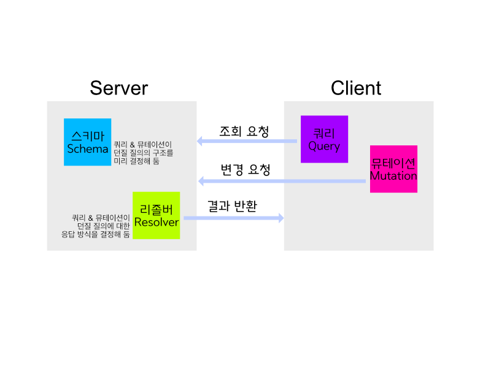
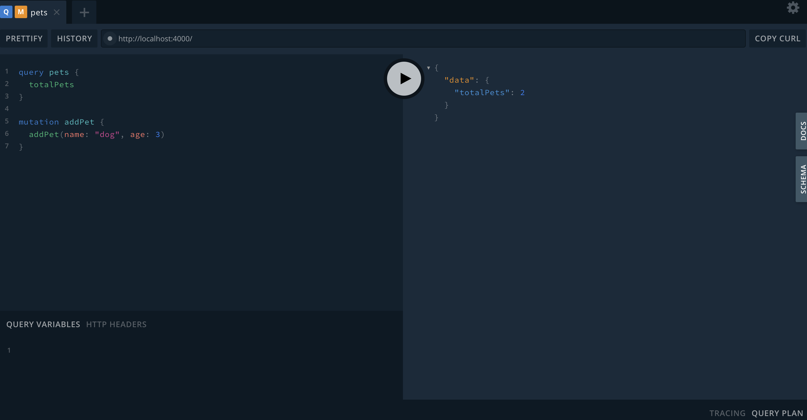

#### GraphQL이란

GraphQL은 2012년 페이스북 개발자들이 모바일 어플리케이션을 제작하면서 만든 쿼리 언어이다. SQL과 마찬가지로 데이터베이스의 정보를 질의하는데 사용되지만 그 구조는 매우 다르다. 페이스북 개발자들은 왜 굳이 새로운 쿼리 언어를 만들면서까지 프론트엔드로 데이터를 보내는 방식을 개선하려고 했을까?

전통적인 REST API는 오버페칭이나 언더페칭 같은, 데이터를 너무 많이 전달하거나 너무 적게 전달하여 불필요한 데이터 전송을 일으키는 문제를 발생시켰다. 또 REST API의 경우 개발이 계속될수록 점점 더 많은 엔드포인트를 필요로 하게 되어 프로젝트 관리를 어렵게 한다.

반면 GraphQL은 프론트엔드에서 필요로 하는 데이터를 있는 그대로 JSON 형태로 표현하여 되돌려받는다는 장점이 있다. 이름이 필요하면 이름만 요청하고, 목록 정보가 필요하면 목록을 함께 요청할 수 있다. 그것도 단 하나의 엔드포인트에서 말이다.

그런데 왜 이름에 'Graph'라는 표현이 붙었을까? GraphQL은 모든 데이터가 그래프 형태로 연결되어 있다고 전제하기 때문이다. 일대일로 연결된 관계도, 여러 계층으로 이루어진 관계도 모두 그래프이다. 단지 그 그래프를 누구의 입장에서 정렬하느냐에 따라 트리 구조를 이룰 뿐이다. GraphQL은 그 그래프를 횡단하여 JSON 트리 구조의 질의 결과를 가져오는 것이다.

#### 서버 사이드와 프론트 사이드에서 챙겨야 할 것

이제 이러한 이론적 바탕으로 실제 코드를 보도록 하자. 서버 사이드에서 프론트 사이드에 이르기까지 GraphQL은 세 가지, 혹은 네 가지의 큰 축을 이동하게 된다.



먼저 스키마에서 전체 질의가 어떤 구조로 이루어지는지를 결정해 둔다. 조회요청 용 질의인 쿼리와 변경요청 용 질의인 뮤테이션에 대한 정보를 모두 기록해두는 것이다. 리졸버는 각 쿼리와 뮤테이션이 날아왔을 때 어떻게 대응할 것인지 응답 방식을 결정해 둔다. 그 후 서버가 실행되면, 클라이언트가 미리 약속된 쿼리 혹은 뮤테이션을 요청하고 서버는 리졸버에서 결정되어 있는 응답을 반환한다. 이것이 GraphQL의 가장 단순한 흐름이다.

#### 서버: 스키마와 리졸버

```javascript
const { ApolloServer } = require('apollo-server'); // 서버를 작동시키기 위한 서버 패키지를 불러옴

const pets = []; // 데이터베이스 역할을 하는 배열
let _id = 0; // 내부적으로 아이디 생성을 돕는 변수

// 스키마
const typeDefs = `
  type Query { // 쿼리 구조를 결정함
    totalPets: Int! // 저장된 반려동물의 총 갯수를 질의하는 쿼리
  }
  
  type Mutation { // 뮤테이션 구조를 결정함
    addPet(name: String! age: Int!): Boolean! // 새로운 반려동물을 저장하는 뮤테이션, 성공하면 true 반환
  }
`;

// 리졸버
const resolvers = {
  Query: {
    totalPets: () => pets.length, // totalPets 쿼리가 왔을 때 어떻게 응답할 것인지 기록
  },

  Mutation: {
    addPet: (parent, args) => {
      // addPet 뮤테이션이 왔을 떄 어떻게 응답할 것인지 기록
      const newPet = {
        id: _id++, // 아이디 추가
        ...args.input, // 인자로 들어온 값을 펼침 연산자로 주입
      };
      pets.push(newPet); // 데이터베이스에 삽입

      return true; // true 반환
    },
  },
};

// 서버 인스턴스 생성
const server = new ApolloServer({ typeDefs, resolvers }); // 스키마와 리졸버를 서버에 전달

// 서버 실행
server
  .listen()
  .then(({ url }) => console.log(`GraphQL Server running on ${url}`));
```

이것이 서버의 전체 코드이다. 아폴로 서버를 실행하면 서버에 자유롭게 질의할 수 있는 플레이그라운드를 제공해 주어 연습용으로 사용할 때 좋다. 여기서는 단순 배열을 데이터베이스로 하여 반려동물을 등록, 조회하는 아주 단순한 형태를 설계했다.

#### 클라이언트: 쿼리와 뮤테이션

위의 파일을 실행하면 클라이언트를 테스트해볼 수 있는 플레이그라운드가 실행될 것이다. 서버가 반환하는 주소가 바로 GraphQL이 여러가지 요청을 전부 받아 소화하는 단 하나의 엔드포인트가 된다.

```
$ node server.js
// -> GraphQL Server running on http://localhost:4000/
```



이제 플레이그라운드에서 쿼리와 뮤테이션을 서버로 요청해볼 수 있다. 위의 화면에서처럼 쿼리를 요청하면 배열의 갯수가 리턴될 것이고, 뮤테이션을 요청하면 그에 해당하는 데이터가 배열에 기록될 것이다.

보다 전문적인 툴을 사용하면 사용자가 일일이 스키마와 리졸버를 지정할 필요 없이 자동으로 생성해주는 것들도 있으니 찾아보기 바란다.

#### 참고 서적

[웹 앱 API 개발을 위한 GraphQL](http://aladin.kr/p/0MScT)
