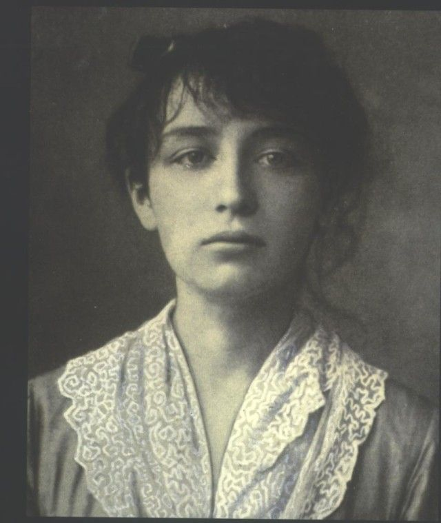
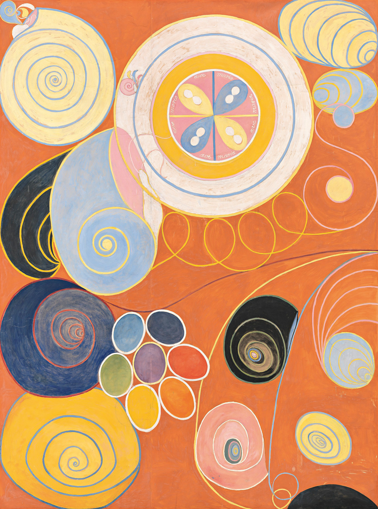
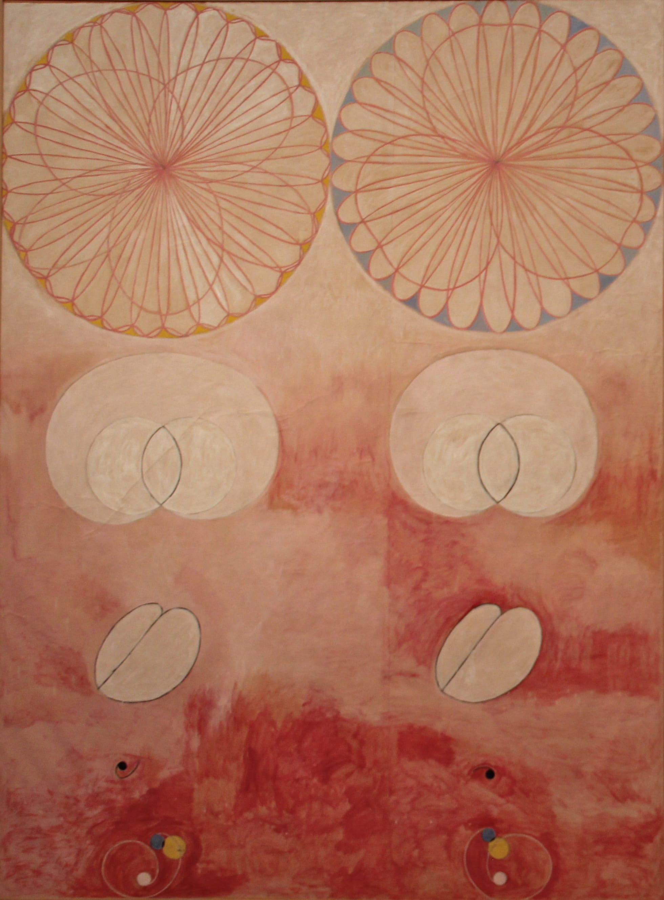
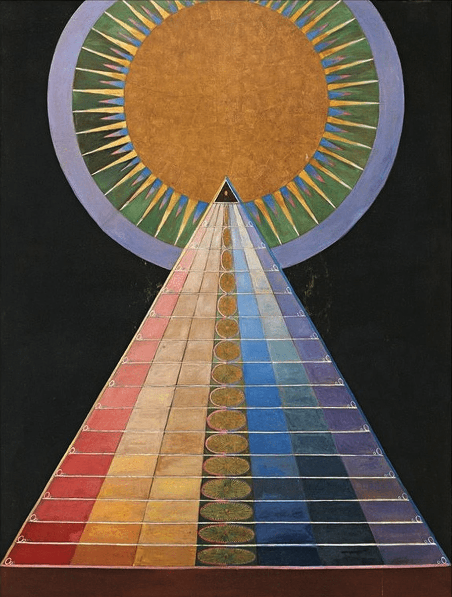
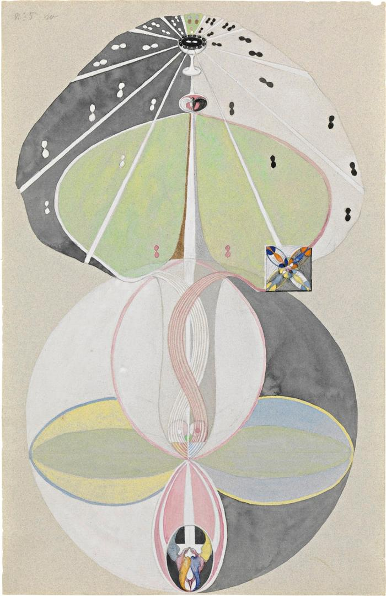

#### 작가 정보

우연히 트위터를 보다가 알게 된 작가다. 어디서부터 설명해야 할까? 1800년대에 등장한 최초의 추상화가, 몬드리안이나 칸딘스키보다 앞서 현대 추상의 개념을 성립한 사람. 그 정도의 묘사로 충분한 걸까? 여자의 신분으로 자신의 그림이 인정받지 못할 걸 예감하고 사후 20년 뒤에 그림을 세상에 공개하라고 유언했던 이야기를 덧붙이면, 그러고 나면 이 작가에 대한 설명이 끝나는 것일까. 그녀의 그림 속에 담긴 한없는 생동감과 영원성을 동경하는 이미지를 전달하고 싶지만 쉽지 않다. 화가의 이야기는 결국 그림 자체로 전달할 수밖에 없다.

#### 대표작

그녀의 대표작 가운데 하나인 <The Ten Largest> 의 '청년(Youth)'이라는 작품이다. 제목에서도 나와 있듯이 열 편의 연작 그림은 사람의 생장 시기를 유년, 청년, 성인, 노년의 네 시기로 나누어 펼쳐놓고 있다. 그림 곳곳에 펼쳐진 조개 껍질과 무지갯빛 꽃의 형상이 다채롭다. 작가는 무엇을 말하고 싶었을까? 빙하 아래 잠들어 있는 씨앗을 묘사한 듯 푸른 빛의 유년기를 지나 붉게 타오르는 청년기에 이르러 한 사람의 꿈과 열정은 꽃망울을 터뜨리기 시작한다. 성인기의 성숙함은 한결 누그러진 분홍색으로 표현되고, 마침내 노년기에 다다르면 영혼의 색채는 투명해지고 화폭에는 다시금 씨앗으로 되돌아가는 원의 형상만이 남겨진다.

클린트는 누이의 죽음을 겪은 뒤 눈에 보이지 않는 영적인 세상을 그림으로 표현하기 위해 애쓰기 시작했다. 그 때문일까, 인상주의 풍경화를 주로 그리던 초기작을 지나고 나면 스케치 노트에 성령(spirit)을 암시하는 문자 형태의 그림들이 나타나기 시작한다. 기하학적이고 완벽한 대칭을 이루는 도형들. 어떤 지향점을 향해 나아가는 강렬한 선. 그녀의 그림은 이곳 너머의 세상과 교신하기 위한 예리한 몸부림이었다.

> 그녀는 영적 세계의 가이드가 그녀에게 해준 말을 믿었다. “당신은 새 시대의 맨 앞에 서 있습니다.” 그렇다. 힐마는 기존 종교와 예술의 틀을 깨는 새 시대를 열었다. - 본문 중에서

