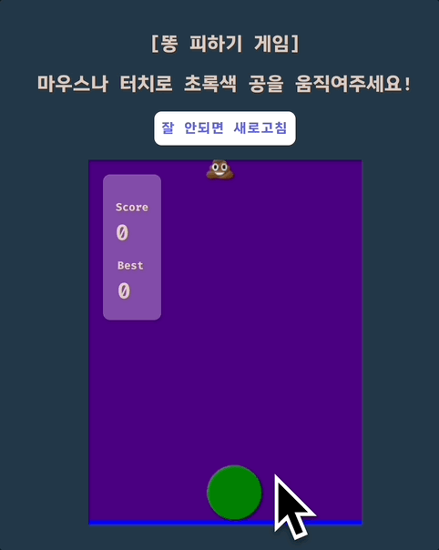
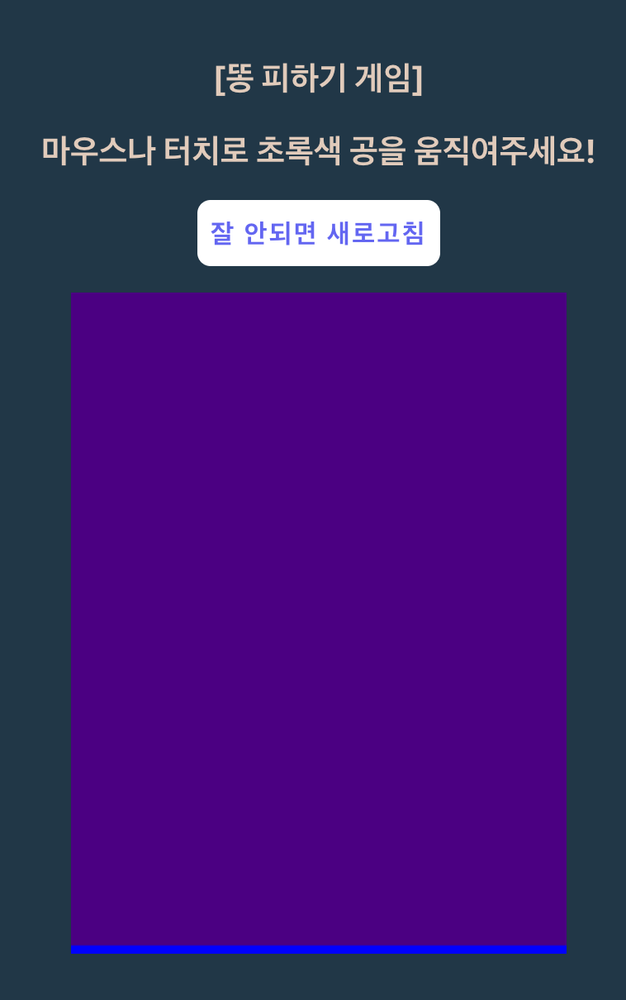
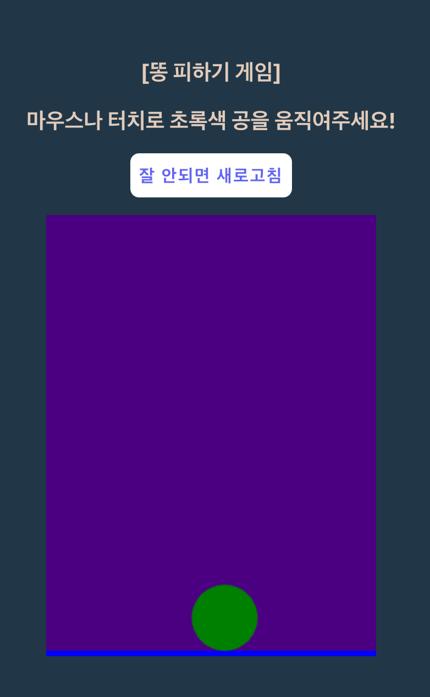

#### 들어가며

[데모 게임 플레이 페이지](/poops)



재밌어 보일지, 아니면 오래 전 학생 때 졸라맨을 가지고 했던 플래시 게임이 떠오를지 모르겠다. 아무튼 이 게임은 자바스크립트로 만들어졌으며, 정확히는 2D 물리엔진을 구현해주는 [Matter.js](https://brm.io/matter-js/) 라이브러리로 만들어졌다. 이것에 대해 얼마나 깊이 있게 설명할 수 있을진 모르겠지만, React 환경 안에서 이 물건을 충분히 가지고 놀 수 있다는 점을 보여주고자 이번 포스팅을 쓰게 되었다. 데모 영상은 용량 때문에 화질도 낮고 프레임도 떨어지지만, 실제 [데모 게임 플레이 페이지](/poops)에서 플레이해보면 아주 부드러운 움직임을 보여준다는 것을 알 수 있다. 클라이언트가 받아야 할 용량도 (아주 작다고 할 순 없지만) 생각 외로 크진 않다.

이번 포스팅에서는 간단한 물리 요소들의 개념을 살핀 뒤 곧장 React 환경 위에서 해당 라이브러리를 이용해 게임을 만드는 과정을 재현해보고자 한다. 이 포스팅의 접근법이 정답이라는 것은 아니지만, 충분히 PoC로서의 역할은 해낸다는 점을 강조하고 싶다. 만일 전체 소스코드가 궁금하다면 [여기](https://github.com/huskyhoochu/funes-days)서 볼 수 있다.

#### Engine, Render, World, Body

Matter.js를 이루는 중요한 네 가지 요소에 대해 살펴보자.

###### Engine

> The Matter.Engine module contains methods for creating and manipulating engines. An engine is a controller that manages updating the simulation of the world. See Matter.Runner for an optional game loop utility.
>
> Matter.Engine 모듈에는 엔진을 만들고 조작하기 위한 메서드가 포함되어 있습니다. 엔진은 세계의 시뮬레이션 업데이트를 관리하는 컨트롤러입니다.

공식 문서에 나와 있는 소개 문구이다. 엔진 모듈은 말 그대로 웹 화면에 구현될 2D 세계를 조작하기 위한 메서드의 집합체라고 보면 된다. 하지만 엔진은 백엔드에 속하는 기능을 담당할 뿐이다. 실제로 시각화된 세상을 표현해 줄 계층은 따로 필요하다. 이것이 렌더 모듈이다.

###### Render

> The Matter.Render module is a simple canvas based renderer for visualising instances of Matter.Engine. It is intended for development and debugging purposes, but may also be suitable for simple games. It includes a number of drawing options including wireframe, vector with support for sprites and viewports.
>
> Matter.Render 모듈은 Matter.Engine의 인스턴스를 시각화하기 위한 간단한 캔버스 기반 렌더러입니다. 개발 및 디버깅 목적이지만 간단한 게임에도 적합할 수 있습니다. 여기에는 와이어프레임, 스프라이트 및 뷰포트를 지원하는 벡터를 포함한 다양한 그리기 옵션이 포함됩니다.

렌더 모듈은 HTML Canvas를 기반으로 하여 엔진 인스턴스의 기능을 시각화해준다. 사방에 똥이 날아다니고, 주인공이 정신없이 피해다니는 상황극을 만들어내는 주인공인 것이다. 그러나 렌더 모듈이 그 모든 걸 다 할 순 없다. 렌더에게는 자신이 그려줄 목적물이 필요하다. 그리고 그 목적물은 배경과 대상으로 나뉠 수 있다. 이것이 World와 Body이다.

###### World & Body

> The Matter.Body module contains methods for creating and manipulating rigid bodies.
>
> Matter.Body 모듈에는 강체를 만들고 조작하기 위한 메서드가 포함되어 있습니다.

World의 경우 현재 Composite라는 모듈로 대체되고 있는 시점이라 문서에 특별한 설명이 없는 상황이다. 하지만 필자의 설명을 믿고 따라와주기 바란다. Body는 아까 말했듯이 렌더 모듈이 그려줄 사각형, 삼각형, 원 등의 대상체를 뜻하게 된다.

#### 게임 만들기

우리는 똥피하기 게임을 만들기로 했으니 몇 가지 시나리오가 필요하다.

1. 하늘에서 무작위로 똥이 떨어져야 한다.
2. 똥은 바닥을 통과해 사라져야 한다. (바닥을 통과하지 못하고 쌓이면 안 된다)
3. 주인공은 바닥을 통과하지 않고 놓여 있어야 한다.
4. 주인공과 똥이 충돌하면 게임이 중단되어야 한다.

시나리오를 간략하게 정의하긴 했지만, 실제 프로그래밍적으로 정의내리자면 저걸 한없이 더 세분화할 수 있을 것이다. 여러분이 처음 코딩 수업을 배웠을 때 했던 '콩을 바구니에 옮기도록 명령하기' 게임처럼 말이다...

###### 배경 만들기

먼저 게임을 위한 배경을 만들어 보자. 우선 우리에게는 이 모든 작업을 가능케 할 Engine과 시각화를 담당할 Render, 배경을 담당할 World가 필요하다. 이것들이 React 위에서 이루어진다는 점에 주의하자. 결국 우리는 외부세계의 모듈을 React 세계에 주입하기 위해 useEffect를 사용할 수밖에 없다.

```tsx
import { useEffect, useRef } from 'react';
import { Engine } from 'matter-js';

const Playground = () => {
  const canvasRef = useRef<HTMLCanvasElement>(null);

  useEffect(() => {
    const engine = Engine.create();
    const render = Render.create({
      engine,
      canvas: canvasRef.current!,
      options: {
        width: 300,
        height: 400,
        background: 'indigo',
        wireframes: false,
      },
    });
  }, []);

  return (
    <div>
      <div
        style={{
          width: 300,
          height: 400,
          marginInline: 'auto',
        }}
      >
        <canvas ref={canvasRef} />
      </div>
    </div>
  );
};
```

그 다음엔 밑바닥을 만들어보자. 모든 로직은 useEffect 안에서 실행된다는 점을 기억하자. 밑바닥은 배경이 아닌 대상물이기에 납작한 사각형으로 제작되며 맵의 가장 아랫부분에 위치할 것이다. 또한 물건들이 통과하지 못하도록 하는 static 속성을 지닌다. 똥만은 통과해야 하는데, 이 문제는 나중에 해결할 것이다.

```tsx
const floor = Bodies.rectangle(160, 400, 400, 10, {
  isStatic: true, // 다른 사물이 통과하지 못함
  collisionFilter: {
    group: -1, // 특정 그룹에 대해서만 다른 효과를 내기 위해 그룹 묶기
  },
  render: {
    fillStyle: 'blue', // 파란색
  },
});
```



###### 유저 만들기

바닥이 만들어졌다. 다음으로는 주인공을 만들어 보자. 우선 다른 텍스쳐 (사진)를 입힐 수도 있겠지만 가시성을 좋게 하고 게임을 단순하게 만들기 위해 초록색 원으로 만들어보겠다. 살아 있을 땐 초록색, 죽으면 빨간색으로 변하는 원이다.

```tsx
const user = Bodies.circle(160, 380, 30, {
  label: 'user',
  render: {
    fillStyle: 'green',
  },
});
```



그 전에, 이 변수들을 어디에 넣어야 이들이 화면에 나타나는지 알려드려야 할 것 같다.

```tsx
World.add(engine.world, [floor, user]);
const runner = Runner.run(engine);
```

useEffect 안에 해당 코드가 들어가면 사물들이 등장할 것이다. World에 사물을 집어넣고 Runner 모듈을 이용해 화면을 실행한다는 뜻이라고 보면 된다.

##### 똥 만들기

어차피 Matter.js는 물리법칙의 세계이기 때문에 허공에서 물체를 생성하면 바닥으로 떨어지도록 되어 있다. 우리가 할 일은 랜덤한 x 좌표에서 지속적으로 물체를 생성하기만 하면 되는 것이다. 그리고 그 물체에 똥 사진 텍스쳐를 입히기만 하면 그만이다.

```tsx
// 15000개의 원 물체를 생성하여
const infiniteArr = Array.from({ length: 15000 }).map(_ => {
  // 맵 x좌표만큼 랜덤한 x좌표에서 생성하도록 설정
  return Bodies.circle(Math.random() * 300, 0, 10, {
    label: 'ball',
    restitution: 0.9,
    collisionFilter: {
      group: -1, // 아까 floor와 동일한 그룹으로 묶어둠 -> -1로 설정해서 충돌하지 않도록
    },
    render: {
      sprite: {
        texture: Poop, // 똥 이미지를 삽입
        xScale: 0.05,
        yScale: 0.05,
      },
    },
  });
});

const wait = (ms: number) =>
  new Promise<void>(resolve => {
    const timeout = setTimeout(() => {
      clearTimeout(timeout);
      resolve();
    }, ms);
  });

const compositeArr: Matter.Body[] = [];

const spreadBall = async (ball: Matter.Body) => {
  compositeArr.push(ball);
  World.add(engine.world, compositeArr); // 새로운 볼을 World에 삽입
  await wait(200); // 200ms 휴식
  compositeArr.pop();
  World.remove(engine.world, compositeArr); // 마지막으로 추가된 볼을 world에서 삭제
};

const event = async () => {
  World.add(engine.world, mouseConstraint);
  Render.run(render);

  for (const ball of infiniteArr) {
    await spreadBall(ball); // 공 하나가 지나감
    totalScore.current = totalScore.current + 1; // 공 하나가 지나감 기록
    setScore(totalScore.current); // 이것이 스코어가 된다
  }
};

event();
```

이제 새로운 똥은 하늘에서 무작위 x 좌표에서 나타나 바닥으로 떨어질 것이다. 그런데 아직 하지 않은 작업이 있다. 똥과 주인공이 충돌하면 스코어 집계가 끝나면서 공이 빨간색으로 바뀌는 효과도 작업해야 한다.

##### 이벤트 추가

```tsx
// 충돌 시작 이벤트 콜백 함수 정의
Events.on(engine, 'collisionStart', async function (event) {
  // 충돌한 두 물체가 user & ball이거나 ball & user인 경우
  const isUserDead = event.pairs.some(
    ev =>
      (ev.bodyA.label === 'user' && ev.bodyB.label === 'ball') ||
      (ev.bodyA.label === 'ball' && ev.bodyB.label === 'user'),
  );

  // 공 색깔을 빨갛게 칠한다
  if (isUserDead) {
    user.render.fillStyle = 'red';
    // 베스트 스코어보다 현재 스코어가 높으면 베스트 스코어 교체
    if (bestScore.current < totalScore.current) {
      bestScore.current = totalScore.current;
    }

    totalScore.current = 0;
    // 1초 뒤에 다시 초록색으로 회복
    await wait(1_000);
    user.render.fillStyle = 'green';
  }
});
```

이제 스코어만 상태관리로 처리하고 화면 위에 띄워놓기만 하면 완성이다. 그 부분은 Matter.js와는 무관하니 여러분이 알아서 구현해보기 바란다.

#### 완성된 코드

```tsx
import React, { useEffect, useRef } from 'react';
import Matter, {
  World,
  Engine,
  Render,
  Bodies,
  Events,
  Mouse,
  MouseConstraint,
  Runner,
} from 'matter-js';
import { useAtom } from 'jotai';
import { scoreAtom } from './play.atom';
// eslint-disable-next-line @typescript-eslint/ban-ts-comment
// @ts-ignore
import Poop from './poop.webp';

const Playground = () => {
  const canvasRef = useRef<HTMLCanvasElement>(null);
  const totalScore = useRef<number>(0);
  const bestScore = useRef<number>(0);
  const [score, setScore] = useAtom(scoreAtom);

  useEffect(() => {
    const engine = Engine.create();
    const render = Render.create({
      engine,
      canvas: canvasRef.current!,
      options: {
        width: 300,
        height: 400,
        background: 'indigo',
        wireframes: false,
      },
    });

    const floor = Bodies.rectangle(160, 400, 400, 10, {
      isStatic: true,
      collisionFilter: {
        group: -1,
      },
      render: {
        fillStyle: 'blue',
      },
    });

    const user = Bodies.circle(160, 380, 30, {
      label: 'user',
      render: {
        fillStyle: 'green',
      },
    });

    const infiniteArr = Array.from({ length: 15000 }).map(_ => {
      return Bodies.circle(Math.random() * 300, 0, 10, {
        label: 'ball',
        restitution: 0.9,
        collisionFilter: {
          group: -1,
        },
        render: {
          sprite: {
            texture: Poop,
            xScale: 0.05,
            yScale: 0.05,
          },
          fillStyle: 'yellow',
        },
      });
    });

    Events.on(engine, 'collisionStart', async function (event) {
      const isUserDead = event.pairs.some(
        ev =>
          (ev.bodyA.label === 'user' && ev.bodyB.label === 'ball') ||
          (ev.bodyA.label === 'ball' && ev.bodyB.label === 'user'),
      );

      if (isUserDead) {
        user.render.fillStyle = 'red';
        if (bestScore.current < totalScore.current) {
          bestScore.current = totalScore.current;
        }

        totalScore.current = 0;
        await wait(1_000);
        user.render.fillStyle = 'green';
      }
    });

    World.add(engine.world, [floor, user]);
    const runner = Runner.run(engine);

    const mouse = Mouse.create(render.canvas);
    const mouseConstraint = MouseConstraint.create(engine, {
      mouse,
    });

    const wait = (ms: number) =>
      new Promise<void>(resolve => {
        const timeout = setTimeout(() => {
          clearTimeout(timeout);
          resolve();
        }, ms);
      });

    const compositeArr: Matter.Body[] = [];

    const spreadBall = async (ball: Matter.Body) => {
      compositeArr.push(ball);
      World.add(engine.world, compositeArr);
      await wait(200);
      compositeArr.pop();
      World.remove(engine.world, compositeArr);
    };

    const event = async () => {
      World.add(engine.world, mouseConstraint);
      Render.run(render);

      for (const ball of infiniteArr) {
        await spreadBall(ball);
        totalScore.current = totalScore.current + 1;
        setScore(totalScore.current);
      }
    };

    event();

    return () => {
      Runner.stop(runner);
      Render.stop(render);
    };
  }, [setScore]);

  return (
    <div className="space-y-[1rem]">
      <p className="text-xl font-bold text-center">[똥 피하기 게임]</p>
      <p className="text-xl font-bold text-center">
        마우스나 터치로 초록색 공을 움직여주세요!
      </p>
      <button
        className="block rounded-lg bg-white text-indigo-500 font-bold p-[0.5rem] mx-auto"
        onClick={() => window.location.reload()}
      >
        잘 안되면 새로고침
      </button>
      <div
        className="relative"
        style={{
          width: 300,
          height: 400,
          marginInline: 'auto',
        }}
      >
        <div className="absolute top-0 left-0 p-[1rem] m-[1rem] rounded-lg shadow w-[4rem] h-[10rem] bg-white/30 flex flex-col items-center justify-center">
          <p className="text-2xl font-bold">
            <span className="text-xs">Score</span> {score}
          </p>
          <p className="text-2xl font-bold">
            <span className="text-xs">Best</span> {bestScore.current}
          </p>
        </div>
        <canvas ref={canvasRef} />
      </div>
    </div>
  );
};

export default Playground;
```

#### 마치며

공식문서의 설명이 그렇게까지 친절하지 않고 대부분 유튜브 강의로 대체되어 있는 탓에 학습이 어렵기는 했지만, 활용하고자 하기만 한다면 무궁무진하게 활용할 수 있을 것 같은 라이브러리였다. 여러분의 사이트에 게임성을 추가하고 싶다면 주저없이 선택해도 좋을 것 같다!
