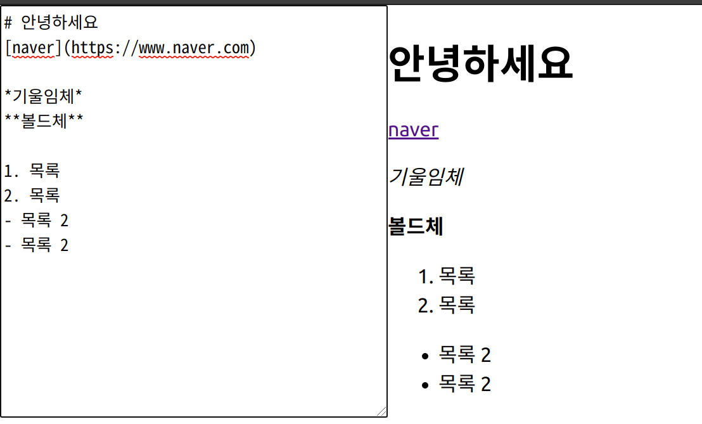

#### 들어가며

개발자에게 가장 친숙한 글쓰기 도구인 마크다운. 이미 시중에는 마크다운 파싱을 위한 고성능 고품질의 파서가 나와 있다. 하지만 이걸 직접 만들어본다면 어떨까? 어떤 구조를 가져야 하는지, 어떻게 html로 변환할지를 한땀한땀 만들어보는 시간을 가져보았다.

#### 구조

파일 구조는 크게 다섯 가지로 나뉜다.

```
|
- index.ts // 라이브러리 실행을 위한 엔드포인트
- normalizer.ts // 줄바꿈을 라이브러리가 원하는 형태로 정규화
- rules.ts // 마크다운 규칙 객체 모음
- tokenizer.ts // 각 라인을 해석해 문장과 규칙이 담긴 토큰으로 변환
- tree.ts // 전체 문서를 토큰화하여 트리 형태로 저장
```

이 구조를 세우기까지 어려웠던 점은 정말 많았다. 크게 정리하자면 세 가지였던 것 같다.

1. 트리를 어느 정도 깊이로 세울까?
2. 블럭 단위 규칙과 인라인 단위 규칙을 어떻게 구분해서 파싱할까? 저장은 어떻게 할까?
3. 어떻게 마크다운을 해석해 원하는 규칙으로 정규화할까?

예시가 될 만한 프로젝트를 찾아보려고 해도 너무 코드 규모가 방대해서 별다른 도움이 되지 못했다. 오래 고민하다가 지금의 구조를 만들었고, 흐름은 다음과 같다.

1. 처음 들어온 문장을 normalizer가 정규화한다.
2. 줄바꿈 문자를 기준으로 문장을 배열로 변환하여 전체를 순회한다.
3. 첫 순회 때 블럭 단위 규칙을 검사해 토큰으로 바꾼다.
4. 토큰 배열을 다시 순회하여 인라인 단위 규칙을 찾아 토큰의 하위 토큰으로 넣는다.
5. 전체 토큰 배열을 트리에 넣는다.

#### normalizer

normalizer의 코드 일부분을 보자.

```typescript
private _normalize(text: string): void {
    const hasCarriage = /\r\n?/g;
    const tooManyNewLine = /\n+$/g;
    this._normalized = text
      .replace(hasCarriage, '\n')
      .replace(tooManyNewLine, '\n')
      .split('\n');
  }
```

이 부분에서 처음 텍스트를 받아 처리한다. 캐리지 리턴이나 문장 맨 마지막에 한 줄 이상의 줄바꿈이 들어오면 모두 한 줄의 줄바꿈으로 바뀌도록 하고, 줄바꿈을 기준으로 문자열을 배열로 바꾼다.

#### rules

rules에서는 블럭 단위 규칙과 인라인 단위 규칙을 선언하고, 각 규칙 객체를 팩토리 패턴으로 만들어 내 배열의 형태로 저장해 둔다.

```typescript
export const enum MDTypes {
  Heading,
  Paragraph,
  OrderedList,
  UnorderedList,
  Hr,
  Blockquote,
  Strong,
  Em,
  Strike,
  Link,
  Img,
}

// 규칙 인터페이스
export interface Rule {
  name: MDTypes;
  rule: RegExp;
  parse: (line: string) => string;
}

// 문단 블럭 규칙
class Paragraph implements Rule {
  name = MDTypes.Paragraph;
  public rule = /(.*)/;
  parse = (line: string) => line.replace(this.rule, '<p>$1</p>');
}

// 헤딩 블럭 규칙
class Heading implements Rule {
  name = MDTypes.Heading;
  rule = /^(#{1,6})\s(.*)/;
  parse = (line: string) => {
    const [heading] = line.split(/\s/);
    return line.replace(
      this.rule,
      `<h${heading.length}>$2</h${heading.length}>`,
    );
  };
}

// ... 더 많은 규칙들 ...

// 이미지 인라인 규칙
class Img implements Rule {
  name = MDTypes.Link;
  rule = /!\[(.*)\]\((.*)\)/;
  parse = (line: string) =>
    line.replace(this.rule, '');
}

export type rule =
  | Ul
  | Paragraph
  | Ol
  | Hr
  | Heading
  | Blockquote
  | Em
  | Strong
  | Link
  | Img;

// 각 규칙 객체를 만드는 팩토리 클래스
class RuleFactory {
  public create(type: MDTypes): rule {
    switch (type) {
      case MDTypes.UnorderedList:
        return new Ul();
      case MDTypes.Paragraph:
        return new Paragraph();
      case MDTypes.OrderedList:
        return new Ol();
      case MDTypes.Hr:
        return new Hr();
      case MDTypes.Heading:
        return new Heading();
      case MDTypes.Blockquote:
        return new Blockquote();
      case MDTypes.Em:
        return new Em();
      case MDTypes.Strong:
        return new Strong();
      case MDTypes.Strike:
        return new Strike();
      case MDTypes.Link:
        return new Link();
      case MDTypes.Img:
        return new Img();
      default:
        return new Paragraph();
    }
  }
}

export const ruleFactory = new RuleFactory();

// 블럭 규칙 배열
export const rulesBlock = ((): rule[] => [
  ruleFactory.create(MDTypes.UnorderedList),
  ruleFactory.create(MDTypes.OrderedList),
  ruleFactory.create(MDTypes.Hr),
  ruleFactory.create(MDTypes.Heading),
  ruleFactory.create(MDTypes.Blockquote),
])();

// 인라인 규칙 배열
export const rulesInline = ((): rule[] => [
  ruleFactory.create(MDTypes.Strong),
  ruleFactory.create(MDTypes.Em),
  ruleFactory.create(MDTypes.Strike),
  ruleFactory.create(MDTypes.Img),
  ruleFactory.create(MDTypes.Link),
])();
```

#### tokenizer

가장 중요한 tokenizer 부분이다. 여기서 가장 핵심적인 로직이 등장한다. 로직의 핵심은 아까 정규화했던 문자열 배열을 순회하면서 규칙 정규표현식에 일치하는 문자열이 나타날 경우 해당 토큰으로 만들어내는 데 있다.

원래 의도는 토큰은 토큰대로 만들고 렌더링은 추가적인 단계에서 진행하는 것이었지만, 구현 능력 부족으로 토큰을 만드는 순간 토큰 객체가 자동으로 html 파싱까지 마치는 식으로 구성했다. (블럭 토큰 안에 인라인 토큰을 만드는 방식을 구현하지 못했기 때문이다. 그래서 인라인 규칙은 이미 파싱된 html 구문을 보고 다시 렌더링하는 방식을 택했다)

```typescript
// 토큰 객체
export class Token {
  private readonly _rule: rule;
  private _value: string;
  private _html: string;
  public children?: Token[];

  constructor(rule: rule, value: string) {
    this._rule = rule;
    this._value = value;
    this._html = '';
    // 생성 단계에서 문자열을 html로 파싱한다
    this.setHtml(this._rule.parse(this.getValue()));
  }
...
}

class Tokenizer {
  private readonly _rulesBlock: rule[];
  private readonly _rulesInline: rule[];

  constructor(rulesBlock: rule[], rulesInline: rule[]) {
    this._rulesBlock = rulesBlock;
    this._rulesInline = rulesInline;
  }

  // 블록 규칙 파싱
  // 블럭 규칙 배열을 순회하며 해당 문자열이 규칙에 맞으면 토큰으로 제작
  private _parseBlock(line: string): Token {
    for (let i = 0; i < this._rulesBlock.length; i++) {
      if (this._rulesBlock[i].rule.test(line)) {
        return new Token(this._rulesBlock[i], line);
      }
    }

    return new Token(ruleFactory.create(MDTypes.Paragraph), line);
  }

  // 인라인 규칙 파싱
  // 블럭 토큰에서 만들어진 html을 검사해 규칙에 맞으면 렌더링을 수행
  // 최종 html을 토큰에 삽입
  private _parseInline(token: Token): void {
    for (let i = 0; i < this._rulesInline.length; i++) {
      if (this._rulesInline[i].rule.test(token.getHtml())) {
        const newHtml = this._rulesInline[i].parse(token.getHtml());
        token.setHtml(newHtml);
      }
    }
  }

  // 블럭 규칙을 순회 후 인라인 규칙 순회
  public tokenize(lines: string[]): Token[] {
    let tokens = lines.map((line: string) => this._parseBlock(line));
    tokens.forEach((token: Token) => this._parseInline(token));
    return tokens;
  }
}

export default Tokenizer;
```

tokenizer 안으로 문자열 배열이 들어가면 먼저 `parseBlock` 함수가 호출된다. 이 함수가 먼저 순수 문자열을 규칙에 따라 html로 파싱한다. 아무 규칙도 발견되지 않으면 paragraph로 처리한다.

각 토큰은 생성되는 순간 자신에게 저장된 rules와 문자열을 이용해 html을 생성한다. html이 생성된 토큰 배열을 이번엔 `parseInline` 함수가 순회하면서 인라인 규칙을 파싱한다. 이렇게 최종 html이 만들어진다.

#### tree

현재까지 구현된 트리는 루트 노드에서 한 단계 레벨 아래에 모든 문장이 모여있는 형태다. 각 자식 노드가 첫째줄, 둘째줄, 셋쩨줄.. 에 해당되는 위치에 담겨 있다고 보면 된다.

```typescript
public show(): string {
    let result = '';

    if (this._root.children) {
      for (let i = 0; i < this._root.size(); i++) {
        const html = this._root.children[i].getHtml();
        result = result + html;
      }
    }

    return result;
  }
```

`show` 함수는 자식 노드를 순회하면서 각 토큰에 담긴 html을 하나의 문자열로 엮어 최종 리턴한다.

#### 결과

Create-React-App 위에 간단하게 데모 코드로 테스트를 해 보았다.

```tsx
import React, { useState, useMemo } from 'react';
import './App.css';
import parse from './dist';

function App() {
  const [value, setValue] = useState('');

  const html = useMemo(() => parse(value), [value]);

  const onChange = e => {
    setValue(e.currentTarget.value);
  };

  return (
    <div className="App">
      <textarea
        style={{ width: '300px' }}
        col={20}
        rows={10}
        value={value}
        onChange={onChange}
      />
      <div dangerouslySetInnerHTML={{ __html: html }} />
    </div>
  );
}

export default App;
```



#### 미진한 사항들

지금까지는 이미 있는 문서를 파싱하는 데에까진 유용하게 쓸 수 있다. 그런데 다른 파서들은 어떻게 하는지 모르겠지만, 중간에 내용의 일부분만 수정되었을 때 그 부분만 업데이트하고 싶은데 현재 파서의 수준으로는 전체 렌더링을 처음부터 다시 해야하는 문제점이 있다.

[저장소](https://github.com/huskyhoochu/ragui-parser)에서 소스코드를 확인해볼 수 있다.
