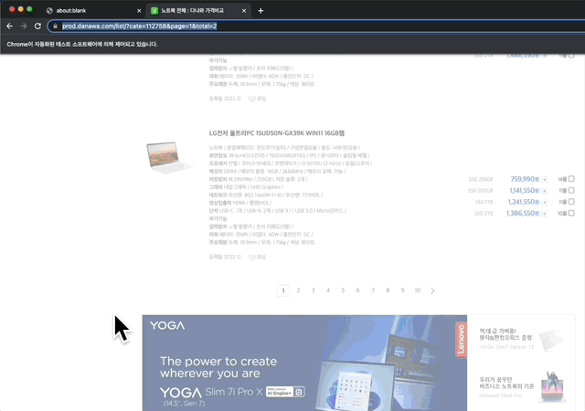

#### 들어가며

회사에서 두번째로 맡은 프로젝트는 다나와의 가전제품 데이터를 정기적으로 저장하는 크롤러를 만드는 일이었다.
우리 팀의 목표는 백오피스 관리자가 특정 카테고리의 상품들을 수집 요청하면 크롤러가 작동해서 크롤러 DB에 원천 데이터를 저장하고, 백오피스 DB가 한번 더 정제된 형태로 원천 데이터를 재수집해가는 흐름을 구축하는 것이었다.

요구사항은 다음과 같았다.

- 한번 크롤링한 상품은 주기적으로 다시 크롤링해 최신 최저가 정보를 누적 저장할 것
- 마이크로 서비스 형태로 제작하여 안정성을 높일 것
- 기존 파이썬 크롤러보다 속도를 향상시킬 것
- 추후 다른 마켓을 크롤링할 수 있음을 염두에 둘 것

최근 팀의 화두가 마이크로 서비스 설계를 지향하여 한 명의 개발자가 하나의 서비스를 완결되게 책임지는 것이었으므로, 가장 큰 범주의 서비스와 서비스 간의 배치부터 서비스 내의 세밀한 작업 흐름에 이르기까지 모두 느슨한 연결, 네트워킹을 이용한 연결을 만들어내고자 하였다. 크롤러와 백오피스도 독립적으로 작동하며 API로만 소통하도록 기획되었고, 내가 맡은 크롤러 또한 내부적으로 하나의 역할만 맡는 리소스들이 서로 통신하며 크롤링을 진행하도록 만들어졌다.

###### 결과물

#### 크롤러 작업 흐름: 마이크로 서비스 구조

#### GCP Pub/Sub 이벤트 스트리밍 서비스

#### 구조 설계

#### Cloud Tasks 메시지 큐가 함께 필요했던 이유

#### 다믐 단계: terraform을 이용한 인프라 형상관리
