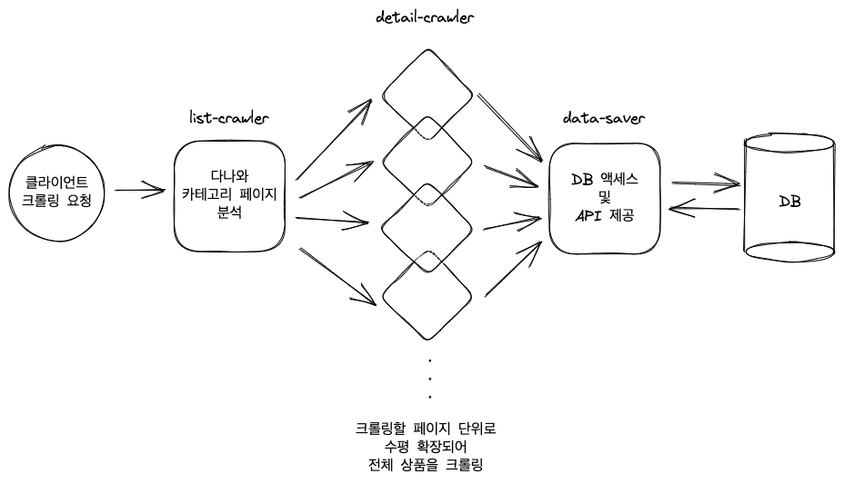
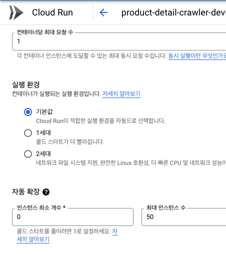
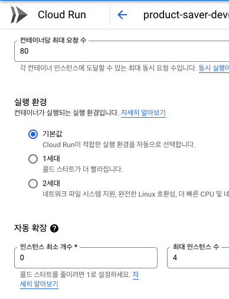
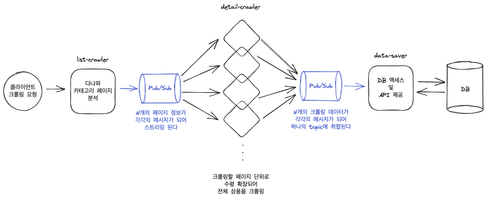

#### 들어가며

회사에서 두 번째로 맡은 프로젝트는 다나와의 가전제품 최저가 및 스펙 데이터를 주기적으로 저장하는 크롤러를 만드는 일이었다.
백오피스 관리자가 특정 카테고리의 상품군을 수집 요청하면 크롤러가 원천 데이터를 모아들이고, 백오피스 서버가 더 정제된 형태로 원천 데이터를 재수집해가는 흐름을 만드는 것이 팀의 목표였다.

요구사항은 다음과 같았다.

- 한번 크롤링한 상품은 주기적으로 다시 크롤링해 최신 최저가 정보를 누적 저장할 것
- 마이크로 서비스 형태로 제작하여 안정성을 높일 것
- 기존 파이썬 크롤러보다 속도를 향상시킬 것
- 추후 다른 마켓을 크롤링할 수 있음을 염두에 둘 것

최근 팀의 화두가 마이크로서비스 설계를 지향하여 한 명의 개발자가 하나의 서비스를 완결되게 책임지는 것이었으므로, 서비스와 서비스 간의 배치부터 서비스 내의 세밀한 작업 흐름까지 모두 느슨히 연결된 구조로 만들어내고자 하였다. 내가 맡은 크롤러 또한 내부적으로 하나의 역할만 맡는 리소스들이 서로 통신하며 크롤링을 진행하도록 구현되었다.

###### 결과물 미리보기

#### 마이크로서비스란 무엇일까?

마이크로서비스의 핵심 키워드는 '기능 분해'라고 할 수 있다. 히나의 코드 베이스, 하나의 서비스로 묶여 있던 모놀리식 아키텍처를 각각의 서비스, 각각의 DB로 분리하여 배치하는 것이 마이크로서비스 아키텍처의 시작이다. 하지만 이건 외견상의 '분해'일 뿐이다. 사상적인 측면에서의 '기능 분해'란, 전체 어플리케이션을 관리 가능한 최소한의 단위로 응집화, 모듈화시키는 것이다. 서비스를 작은 단위로 모듈화시키면 각 팀이 자율적으로 움직이게 되고, 기능 오류나 서비스 과부하의 리스크를 분산할 수 있으며 배포와 확장이 용이해진다. 새로운 기술 도입이 쉬워진다는 장점은 덤으로 들어온다.

물론 마이크로서비스에 장점만 있는 것은 아니다. 하나의 서비스가 실패하더라도 전체 어플리케이션이 여전히 동작하도록 가용성을 유지하는 것, 서비스 간에 복잡하게 오고가는 요청들을 안정적으로 관리하는 것이 개발팀에 있어서 어려운 과제가 될 것이다.

모놀리식 아키텍처에 비해 늘어나는 관리 포인트 부담을 줄이기 위해 우리 팀은 GCP가 제공하는 서비스를 최대한 이용하기로 결정했다. 이번 포스팅에선 마이크로서비스 형태로 크롤러를 구축하면서 어떤 방식으로 구조를 설계했고, 각 포인트마다 어떤 GCP 서비스를 사용했는지 소개하고자 한다.

#### 크롤러 기능 분해하기

크롤러는 다나와 웹사이트의 카테고리 페이지를 분석하는 과정, 각 페이지를 병렬적으로 방문하며 상품 세부 정보를 모아들이는 과정, 수집한 데이터를 DB에 저장하는 과정까지 세 가지로 나뉜다.

그림으로 설명하면 다음과 같다.

구현 시점에서는 각각의 단일 기능 서비스를 세 개의 독립된 코드 베이스로 제작했다.

- `list-crawler`: 다나와 카테고리 페이지를 분석해 해당 카테고리의 총 상품이 몇 개인지, 크롤링할 페이지는 몇 장인지 판단하는 크롤러
- `detail-crawler`: 한 인스턴스 당 하나의 페이지를 맡아 전체 페이지를 병렬 처리하는 크롤러
- `data-saver`: 크롤링 데이터를 DB에 저장하고 DB와 관련된 각종 API를 제공하는 서버

배포는 컨테이너형 어플리케이션 배포 서비스인 GCP Cloud Run을 이용했다. Cloud Run에서는 하나의 서비스가 동시에 몇 건의 요청까지 처리하게 할 것인지, 최대로 확장될 인스턴스 갯수를 얼마나 할지를 자유롭게 설정할 수 있다. 그래서 병렬 처리를 최대한 활용해야 하는 `detail-crawler`는 최대 처리 요청 수를 1건으로 줄인 뒤 확장 인스턴스 갯수를 다수로 잡고, DB 커넥션 풀을 적게 소비해야 하는 `data-saver`는 최대 처리 요청 수를 다수로 잡되 확장 인스턴스 갯수를 최소한으로 처리했다.

    

        
         
        병렬처리를 위해 최대 요청 수를 줄이고
         
        최대 인스턴스 수를 증가시킴
    

    

        
         
        DB 커넥션 풀을 활용하고자 최대 요청 수를 늘리고
         
        최대 인스턴스 수를 감소시킴
    

이 구조의 성공과 실패를 좌우하는 건 '과연 서비스는 서로 어떻게 통신할 것인가?' 라는 질문에 적절한 해답을 제시하는 것이었다. 이를 정하기 위해 수많은 통신 프로토콜을 비교할 수도 있었지만, 거기에 앞서 우리는 '서비스가 서로 직접 통신하게 할 것인가, 공통의 채널을 이용해 통신하게 할 것인가?'를 먼저 결정해야 했다.

Cloud Run은 인스턴스의 CPU 부하가 높아지면 자동으로 인스턴스를 수평 확장하는 기능을 갖추고 있다. 그렇기에 총 페이지가 수 개에서 수십 개가 넘어가는 상품군의 크롤링을 요청할 경우, 상품 세부 정보를 크롤링하는 인스턴스는 N개 이상으로 확장될 것이다. 모든 크롤링이 병렬적으로 이루어지기에 어떤 페이지의 작업이 먼저 끝날지, 어떤 데이터가 빠르게 전송될 것인지 예측할 수 있는 건 아무것도 없다. 이런 상황에서 각 서비스가 직접 소통하는 방식을 취한다면? 데이터가 소실되거나 DB 저장 요청이 한꺼번에 늘어나면서 기록 실패가 발생할 가능성도 커진다. 안정적인 운영을 위해서는 확장된 크롤러가 공통의 채널 혹은 파이프라인으로 데이터를 전송해 DB 저장 서비스가 순차적으로 값을 받아볼 수 있도록 만들어야 한다.

GCP의 Pub/Sub 이벤트 스트리밍 서비스가 이런 상황에서 사용하기에 가장 알맞은 것이었다.

#### GCP Pub/Sub: 이벤트 스트리밍 파이프라인

참조: [Pub/Sub이란 무엇인가요? | Google Cloud](https://cloud.google.com/pubsub/docs/overview?hl=ko)

Pub/Sub을 쉬운 말로 소개하자면 'RabbitMQ에 Kafka를 끼얹은 서비스'라고 볼 수 있다. RabbitMQ와 같이 특정한 topic을 중심으로 producer와 consumer가 비동기적으로 메시지를 주고받는 메시징 미들웨어의 기본 구조를 갖지만, 여기에 Kafka가 지원하는 수평적 확장 기능 또한 추가되어 있다. 서비스와 서비스 사이에 초당 수천 건의 메시지가 오가더라도 자유자재로 확장-축소를 거듭하며 안정적인 메시지 송/수신을 돕는다.

#### 구조 설계

우리의 크롤러 서비스에 Pub/Sub을 적용하며 구조를 구체화 해보자.

다나와에서 '로봇청소기' 카테고리 페이지의 모든 상품을 크롤링한다 가정했을 때,

#### Cloud Tasks 큐가 함께 필요했던 이유

#### 다믐 단계: terraform을 이용한 인프라 형상관리
