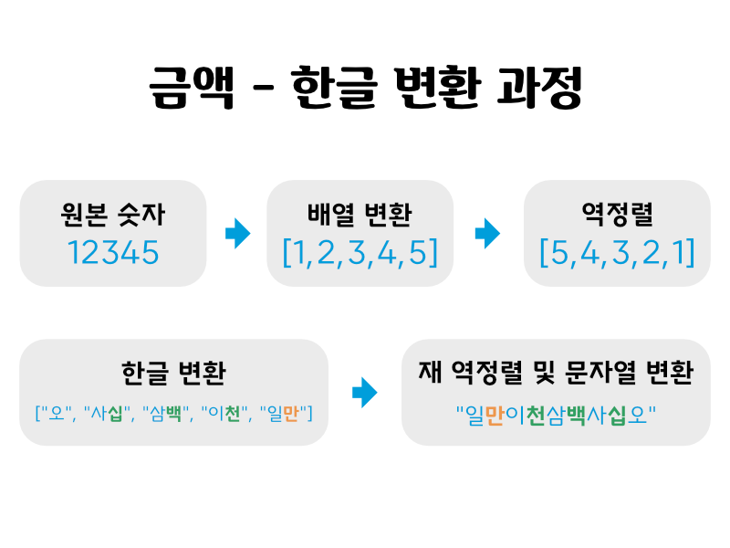
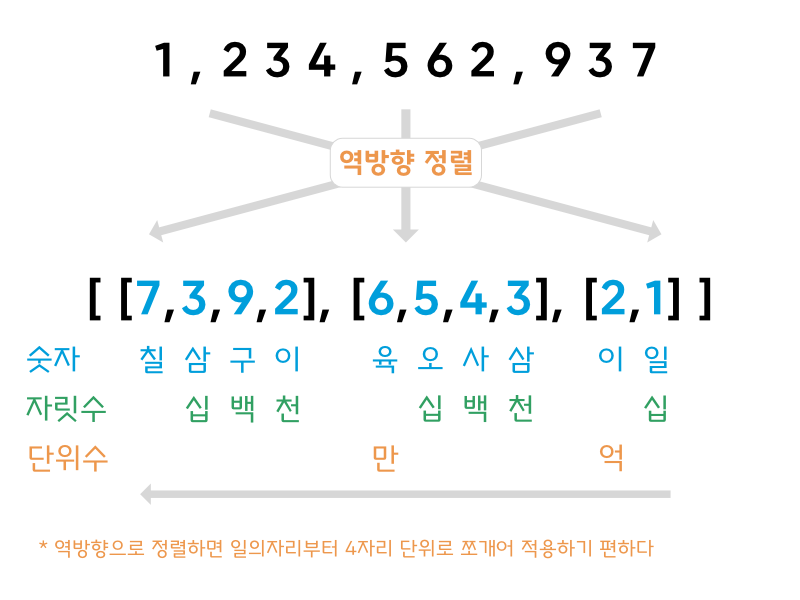
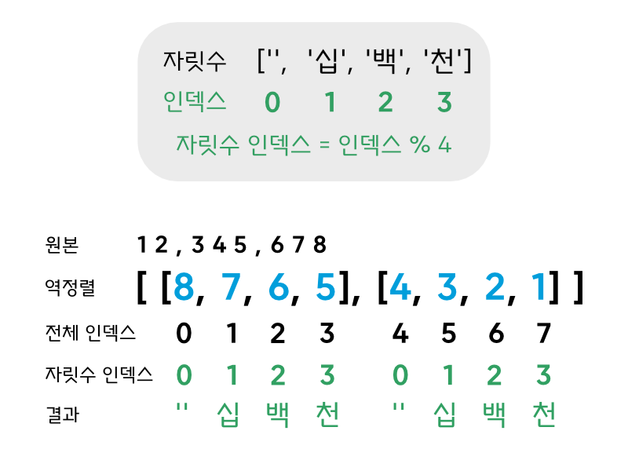
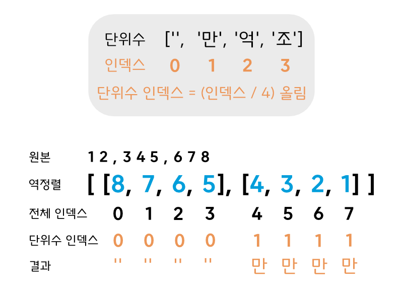
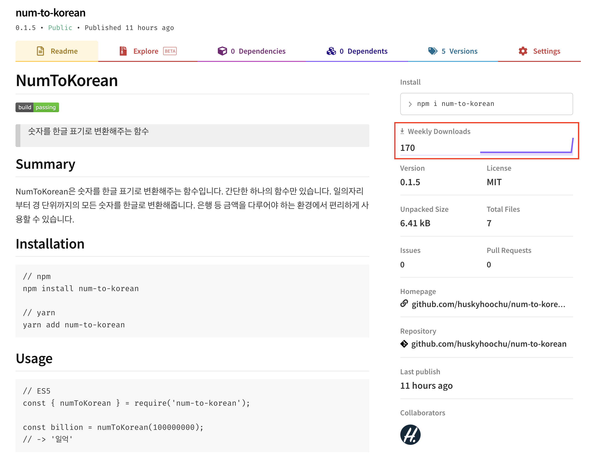
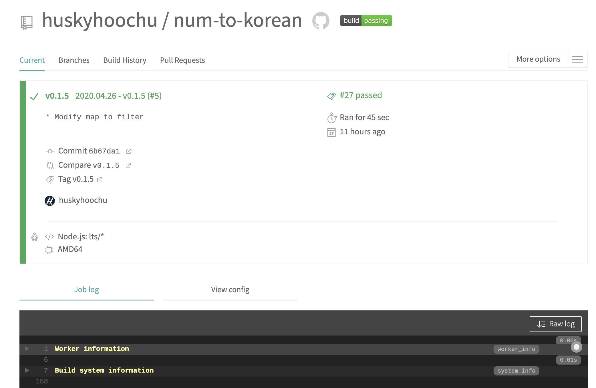

#### 들어가며

오픈소스를 운영하는 게 오랜 버킷리스트였다. 하지만 항상 계획 과정에서 꿈이 너무 원대해지다 보니 목표를 감당 못해 무너지곤 했는데... 이번에는 정말 작은, 기능이 단 하나뿐인 함수를 운영하기로 했다. 어떤 금액을 숫자로 입력하면, 그 숫자를 한글로 바꿔주는 함수다. 타입스크립트로 작성했고 npm에 발표한 상태다.

[github 저장소](https://github.com/huskyhoochu/num-to-korean)

[npm 패키지](https://www.npmjs.com/package/num-to-korean)

#### num-to-korean 원리

이 함수에서 벌어진 전체 변환 과정을 요약하면 다음과 같다.



###### 역정렬

전체 과정 중에서 특이한 지점은 '역정렬' 부분이다. 왜 한글 변환을 할 때 원본 숫자를 역방향으로 정렬하는가? 왜냐면 십, 백, 천으로 반복되는 자릿수와 만, 억, 조 등으로 증가하는 단위수가 일의자리부터 4자리마다 반복되기 때문이다.



이러한 원리를 적용해보기 위해 가장 먼저 0~9 와 대응할 숫자 배열, 4자리마다 반복되는 자릿수 배열, 4자리마다 커지는 단위수 배열을 정의하자.

```typescript
// 한글로 바꿀 숫자 배열
const textSymbol = ['', '일', '이', '삼', '사', '오', '육', '칠', '팔', '구'];
// 4자리마다 반복되는 자릿수 배열
const powerSymbol = ['', '십', '백', '천'];
// 4자리마다 커지는 단위수 배열
const dotSymbol = ['', '만', '억', '조', '경'];
```

숫자 배열(`textSymbol`)의 각 숫자의 위치가 배열 인덱스 값과 일치하기 때문에, 변환하고 싶은 숫자를 인덱스로 대입하면 곧장 원하는 숫자를 얻을 수 있다.

```
1 -> textSymbol[1] -> "일"
7 -> textSymbol[7] -> "칠"
9 -> textSymbol[9] -> "구"
```

###### 자릿수 처리

자릿수는 4자리마다 반복 적용되어야 한다. 그러자면 `["", "십", "백", "천"]` 으로 정의된 자릿수 배열에서 각 위치의 값을 반복해서 받아와야 한다. 이를 위해선 0,1,2,3,4...로 증가하는 원본 인덱스에 어떤 식을 넣었을 때 0,1,2,3, 0,1,2,3...으로 반복되도록 만들어야 한다. 답은 간단하다. **원본 인덱스를 4로 나눈 나머지를 자릿수 인덱스로 사용하면 된다.**



###### 단위수 처리

마지막으로 단위수가 남는다.`["", "만", "억", "조", "경"]` 으로 정의된 단위수 배열을 가정했을 때, 단위수 인덱스는 원본 숫자가 4자리가 거듭될 때마다, 즉 첫번째, 5번째, 9번째 자리마다 증가해야한다. 이번에는 **원본 인덱스를 4로 나눈 값을 올림하는 것으로 구할 수 있다.** 원본 인덱스가 0, 1, 2, 3인 구간까지는 단위수 인덱스가 0이 나오고, 4, 5, 6, 7인 구간에서는 1이, 8, 9, 10, 11인 구간에서는 2가 나오면서 4자리마다 1씩 증가하게 되는 것이다.



여기서 만 단위 이상의 모든 숫자에 단위수가 붙지 않도록 간단한 조건문을 달아주자. **자릿수 인덱스가 0일 때만 단위수 인덱스가 붙도록 하면 될 것이다.**

이제 원본 숫자를 역정렬하여 한글로 변환하는 과정까지를 코드로 확인해보자.

```typescript
const koreanArr = num
  .toString() // 숫자 -> 문자열
  .split('') // 하나의 숫자 문자를 하나의 원소로 갖는 배열로 변환
  .map((numText: string) => parseInt(numText, 10)) // 각 배열의 원소를 숫자로 변환
  .reverse() // 배열 역방향 정렬
  .map((item: number, index: number) => {
    // 자릿수 인덱스: 원본 인덱스를 4로 나눈 나머지
    const powerIndex = index % 4;
    // 단위수 인덱스: 원본 인덱스를 4로 나눈 몫을 올림
    const dotIndex = Math.ceil(index / 4);

    // 숫자: 숫자 배열에 숫자 자체를 인덱스로 대입
    const text = textSymbol[item];
    // 자릿수: 숫자가 0이 아닐 경우에만 적용
    const power = item === 0 ? '' : powerSymbol[powerIndex];
    // 단위수: 자릿수 인덱스가 0일 때만 적용
    const dot = powerIndex === 0 ? dotSymbol[dotIndex] : '';

    return `${text}${power}${dot}`;
  });
```

실제 코드에서는 위에서 살펴보지 않은 특이 케이스를 처리하는 조건문이 15번 라인에 담겨 있다. 어떤 숫자의 중간에 0이 담겨 있다면, 그 0에 해당하는 자릿수는 함께 생략되어야 하는 것이 맞다.

원본 숫자를 저 과정까지만 거치면 이런 결과가 나온다.

```
12345678 -> ["팔", "칠십", "육백", "오천", "사만", "삼십", "이백", "일천"]
50001 -> ["일", "", "", "", "오만"]
100000000 -> ["", "", "", "", "만", "", "", "", "일억"]
```

###### 단위수가 생략되어야 할 조건

지금까지는 모두 우리가 의도한 결과를 얻을 수 있었다. '일억'이라는 케이스를 적용해보기 전까지는 말이다. `100,000,000`을 적용하자 `"일억만"`이라는 결과가 나온다. 만일 `1,000,000,000,000`, 즉 1조를 적용해보면 어떨까?

```
1000000000000 -> ["", "", "", "", "만", "", "", "", "억", "", "", "", "일조"]
```

이 결과를 그대로 합치면 `"일조억만"`이라는 결과가 나올 것이다. 왜 이럴까? 지금의 조건문으로는 최고 자리 외에 모든 숫자가 0일 경우 단위수를 생략해야 한다는 규칙이 적용되어 있지 않기 때문이다.

그런데 여기서는 한번 더 깊게 생각해야만 한다. 단순히 마지막 글자 젹용 과정에서 조건문을 추가하는 것으로 이 문제가 해결될 수 있을까? 단위수를 넣느냐 빼느냐는 조금 더 복잡한 규칙에 따라 결정된다.

만일 만 단위, 억 단위가 0일 경우에 단위수를 생략하는 조건문을 심으면 어떤 일이 벌어질까? 다음과 같은 경우를 생각해 보자.

```
130000000 -> ["", "", "", "", "", "", "", "삼천", "일억"]
1070000100000 -> ["", "", "", "", "", "일십", "", "", "", "", "칠백", "", "일조"]
```

`130,000,000`은 `"일억삼천"`이 되고 `1,070,000,100,000`은 `"일조칠백일십"`이 된다. 단순히 만 자리, 억 자리가 0일 때 단위수가 생략되면, 만 ~ 천만 구간, 억 ~ 천억 구간 사이에 다른 숫자가 담겼을 때 올바른 단위수를 입력받지 못하게 된다.

**즉 단위수가 생략되어야 할 조건은, 단위수가 속한 4자리 구간 전체가 0일 때만으로 한정되어야 한다.**

우리가 그동안 숫자 인덱스를 계산할 때 배열을 역방향으로 정렬하고 4자리 단위로 나누어 생각했던 이유가 바로 여기에 있다. 이제 1억 배열을 4자리 단위로 다시 쪼개어 보자.

```
// 단위수가 생략되어야 할 경우
100000000 -> [["", "", "", ""], ["만", "", "", ""], ["일억"]]

// 단위수가 생략되지 말아야 할 경우
130000000 -> [["", "", "", ""], ["만", "", "", "삼천"], ["일억"]]
```

배열을 4자리 단위의 배열 속 배열로 나누었을 때, 한 구간 안에서 숫자가 하나도 없이 단위수만 존재한다면 그 단위수는 제거해도 좋다. 하지만 구간 중에서 단 한 곳이라도 숫자가 존재한다면 단위수는 제거되어선 안 된다.

이 논리를 코드에 적용하면 다음과 같이 된다.

```typescript
const removeUnusedDot = splitEvery(4, koreanArr) // 글자 배열의 원소를 4개씩 묶어서 배열 속 배열로 가공
  // 배열 속 배열의 모든 원소를 하나의 문자로 합쳤을 때 dotSymbol 안에 속하지 않는 배열만 필터링
  // 예: ["만", "", "", ""] -> "만"
  // 이 경우 "만"은 dotSymbol 안에 속하게 된다. 즉 구간 내의 모든 숫자가 0이라는 뜻이므로 생략해도 좋다
  .filter((slicedByDot: string[]) => !dotSymbol.includes(slicedByDot.join('')));
```


이제 배열 속 배열을 평탄화한 뒤 다시 역방향 정렬 후 문자열로 합치면... 모든 과정은 끝난다. 숫자는 완벽하게 한글로 변환된다!

현재 저장소 안에는 여러가지 경우에 대한 테스트 케이스가 함께 담겨 있다.

###### 테스팅

```typescript
describe('숫자 금액을 한글로 변환하기 테스트', () => {
  test('잘못된 값 처리', () => {
    const answers = [
      {
        korean: '',
        num: 0,
      },
      {
        korean: '',
        num: NaN,
      },
    ];

    answers.forEach(answer => {
      expect(numToKorean(answer.num)).toBe(answer.korean);
    });
  });

  test('일의자리', () => {
    const answers = [
      {
        korean: '일',
        num: 1,
      },
      {
        korean: '삼',
        num: 3,
      },
      {
        korean: '구',
        num: 9,
      },
    ];

    answers.forEach(answer => {
      expect(numToKorean(answer.num)).toBe(answer.korean);
    });
  });

  test('모든 자릿수가 숫자로 찼을 때', () => {
    const answer = {
      korean: '일십이억삼천사백오십육만칠천팔백구십팔',
      num: 1234567898,
    };
    expect(numToKorean(answer.num)).toBe(answer.korean);
  });

  test('모든 자릿수가 0일 때', () => {
    const answers = [
      {
        korean: '일십',
        num: 10,
      },
      {
        korean: '일백',
        num: 100,
      },
      {
        korean: '일천',
        num: 1000,
      },
      {
        korean: '일만',
        num: 10000,
      },
      {
        korean: '일십만',
        num: 100000,
      },
      {
        korean: '일백만',
        num: 1000000,
      },
      {
        korean: '일천만',
        num: 10000000,
      },
      {
        korean: '일억',
        num: 100000000,
      },
      {
        korean: '일십억',
        num: 1000000000,
      },
    ];

    answers.forEach(answer => {
      expect(numToKorean(answer.num)).toBe(answer.korean);
    });
  });

  test('0과 0이 아닌 숫자가 섞였을 때', () => {
    const answers = [
      {
        korean: '일십삼만사천이백삼십사',
        num: 134234,
      },
      {
        korean: '일백삼십만구',
        num: 1300009,
      },
      {
        korean: '이천오백만오천',
        num: 25005000,
      },
      {
        korean: '일억이천만일',
        num: 120000001,
      },
      {
        korean: '사억오천오십만일천이십',
        num: 450501020,
      },
    ];

    answers.forEach(answer => {
      expect(numToKorean(answer.num)).toBe(answer.korean);
    });
  });

  test('극단적으로 큰 수', () => {
    const answers = [
      {
        korean: '일천조이백억칠천',
        num: 1000020000007000,
      },
      {
        korean: '일경',
        num: 10000000000000000,
      },
    ];

    answers.forEach(answer => {
      expect(numToKorean(answer.num)).toBe(answer.korean);
    });
  });
});
```

테스트는 현재까지 모두 통과 중이다.


#### 현재까지의 성과

현재 v0.1.5 버전으로 github 및 npm에 릴리즈 중이다.

[github 저장소](https://github.com/huskyhoochu/num-to-korean)

[npm 패키지](https://www.npmjs.com/package/num-to-korean)

npm에서는, 아직까지 아무런 홍보도 하지 않았는데 주간 다운로드 170회를 기록했다! (정말 감사합니다 꾸벅)



CI 툴로는 github README 페이지에 뱃지를 달고 싶어서 Travis CI를 사용했다.



저장소를 확인해보면 알겠지만, `npm publish`를 수행할 때 webpack 빌드를 거쳐 minify, uglify 모두 수행하고 있다. UMD 옵션을 사용해 node 환경이나 browser 환경 모두 사용하도록 해 두었다.

아직까지 고민되는 부분은 `0`의 표현 방식이다. 지금까지는 `0`을 입력했을 때 빈 문자열을 리턴하도록 되어 있다. 하지만 `"영"`이라고 예외 처리를 해 줘야 할지 어떨지 고민이다. 금액을 한글로 표기해야 하는 은행 시스템의 경우 굳이 `"영"`이라고 표기되면 오히려 혼란이 가중된다는 생각이 들어서 지금까지는 추가하지 않고 있었다.

만일 특정 환경에서 사용이 원활하지 않다거나, `0`을 `"영"`으로 표현해야 할 사례가 있다거나, 테스트 케이스를 더 많이 추가해야 한다거나 기타 여러 의견이 있으시면 저장소에 이슈를 남겨주시길 바란다!
