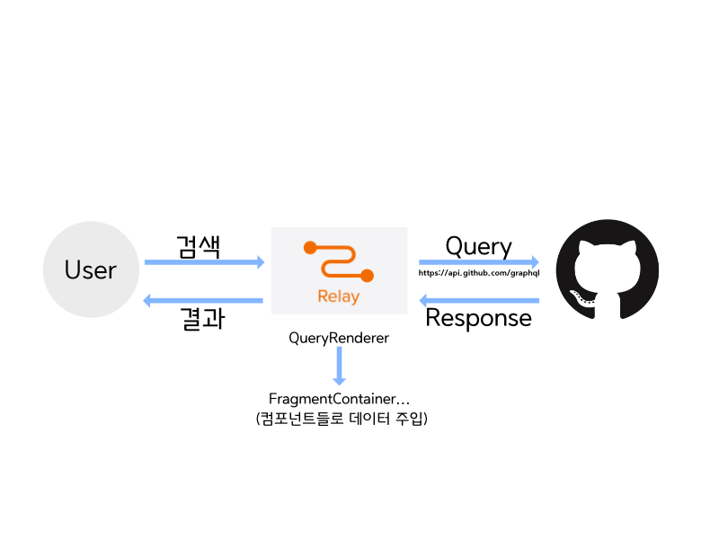

#### 결과물 데모

[https://react-relay-github.vercel.app/](https://react-relay-github.vercel.app/)

Github 저장소: [https://github.com/huskyhoochu/react-relay-github](https://github.com/huskyhoochu/react-relay-github)

#### 공식 문서 외에는 정말 정보가 없다

[Relay](https://relay.dev/en/)는 GraphQL을 만든 Facebook이 직접 발표한 클라이언트인데도 이상하게 인기가 없다. Apollo에게 대부분의 수요를 빼앗긴 느낌이랄까? 그래도 React - GrapqhQL - Relay로 이어지는 삼위일체 Facebook 패키지로 페이지를 만들어보고 싶다는 생각이 들었다. 이번에 도전한 과제는 Github API를 이용한 유저 검색 프로젝트였다.

Relay의 컨셉은 무엇일까? React가 선언형 DOM 라이브러리였고 GraphQL이 선언적 쿼리 언어였듯이, Relay 또한 선언적으로 어떤 쿼리를 fetch할 것인지를 컴포넌트에서 직관적으로 확인할 수 있도록 하는 게 목표인 듯하다.

Relay의 구조는 크게 두 가지로 나뉜다. 하나는 컴포넌트가 마운트되는 순간 데이터를 Fetch해 자식 컴포넌트에게 전달하는 QueryRenderer가 있고, QueryRenderer로부터 어떤 데이터를 받아오는지를 적시한 자식 컴포넌트인 FragmentContatiner가 있다. 우선은 예제 프로젝트의 흐름을 보면서 이해해보도록 하자.

#### 예제 프로젝트

이번에 Relay 연습을 위해 만든 것은 Github GraphQL API ([https://docs.github.com/en/graphql](https://docs.github.com/en/graphql))를 이용해 구현한 유저 검색 프로젝트이다. Github에서는 자사의 리소스를 검색 / 수정할 수 있도록 돕는 퍼블릭 API를 제공하고 있다. API는 REST, GraphQL 두 가지 형태로 모두 제공되니 필요한 분들은 사용하시면 되겠다. 단, API를 사용하기 위해서는 personal access token을 발급받아 요청 때마다 header에 심어 보내야 한다.

personal access token을 발급받으려면 먼저 github settings로 들어간다.


settings 페이지가 나타나면 personal access token을 누른 뒤 generate new token 버튼을 누른다.


그 후 토큰에 허용할 권한을 등록한다. 이번에는 repository와 user에 관한 읽기 권한만을 추가해서 토큰을 생성하겠다.

토큰 이름을 적고 토큰 생성 버튼을 누르면 토큰이 발급되는데, 발급 페이지를 벗어나면 더 이상 토큰을 알려주지 않으니 중요하게 보관하도록 해야 한다.

다음으로 Github API의 스키마를 이곳에서 다운로드 받는다.

[https://docs.github.com/en/graphql/overview/public-schema](https://docs.github.com/en/graphql/overview/public-schema)

미리 정의된 스키마를 사용하면 relay-compiler가 컴포넌트 안에 있는 쿼리를 자동 감지하여 실제 요청을 보낼 코드를 생성해줄 것이다. 이 부분은 이따가 살펴보자.

우선은 프로젝트의 큰 흐름을 파악하는 게 먼저다.



#### QueryRenderer

QueryRenderer는 Relay의 중심이 되는 영역으로, 이 컴포넌트 전체가 어떤 데이터를 받아와서 자식들에게 공급하는지 보여주는 데이터 선언 장소라고 생각할 수 있다.

Fetch에 사용되는 Github API 쿼리가 이곳에서 선언된다.

```tsx
const App: React.FC = () => {
  const { login } = useParams<{ login: string }>();

  return (
    <QueryRenderer<AppUserQuery>
      environment={environment}
      query={graphql`
        query AppUserQuery($login: String!) { // query가 선언되는 부분
          user(login: $login) {
            ...User_user // GraphQL의 Fragment 문법
          }
        }
      `}
      variables={{
        login,
      }}
      render={({
        error,
        props,
      }: {
        error: Error | null;
        props: AppUserQueryResponse;
      }) => {
        if (error) {
          return <Error message={error.message} />;
        }

        if (!props) {
          return <Loading />;
        }

        if (!props.user) {
          return <Error message={'검색결과가 없습니다.'} />;
        }

        return <User user={props.user} />;
      }}
    />
  );
};
```

이곳에서 Fetching된 데이터 결과에 따라 `render` props를 통해 로딩 중, 정상, 검색결과 없음, 오류 등의 상태를 분기하여 표기할 수 있다.

여기에서 두 가지 궁금증이 생겨날 수 있다.

1. 쿼리가 여기서 선언된다고 했는데, 왜 전체가 보이지 않을까?
2. 실제 fetch를 하는 함수는 어디에 있을까?

#### FragmentContainer

프래그먼트(Fragment)는 GrapphQL에서 재사용이 가능한 셀렉션 세트의 일종이다. 프래그먼트로 쿼리를 정의하면 여러 곳에서 동일한 쿼리가 필요할 때 일일이 전체를 다시 적는 수고를 들이지 않을 수 있다.

FragmentContainer는 실제 데이터를 Fetching하지는 않지만, 자기 자신이 어떤 데이터를 제어하는지를 선언해놓는 역할을 한다. 이 컴포넌트는 QueryRenderer의 자식에 위치하면서도 역설적으로 부모인 QueryRenderer에게 Fragment를 공급하는 역할을 한다.

코드를 보자.

```tsx
const User: React.FC<{
  user: User_user;
}> = ({ user }) => {
  return (
    <div className="user">
      <Helmet>
        <link
          id="favicon"
          rel="shortcut icon"
          type="image/png"
          href={user.avatarUrl as string}
        />
        <title>{`${user.login} | Github Profile`}</title>
      </Helmet>
      <Profile user={user} />
      <Repo user={user} />
      <ToggleDark />
    </div>
  );
};

export default createFragmentContainer(User, {
  user: graphql`
    fragment User_user on User { // 이 프래그먼트에서 실제 쿼리가 선언된다
      name
      avatarUrl
      bioHTML
      createdAt
      email
      followers {
        totalCount
      }
      following {
        totalCount
      }
      login
      websiteUrl
      url
      repositories(
        first: 6
        isFork: false
        orderBy: { field: STARGAZERS, direction: DESC }
      ) {
        totalCount
        nodes {
          id
          name
          descriptionHTML
          stargazerCount
          createdAt
          url
        }
      }
    }
  `,
});
```

App.tsx의 자식인 User.tsx는 부모인 QueryRenderer에게 자신이 쓸 데이터 프래그먼트를 전달하고 그에 해당하는 실제 데이터를 props로 전달받는다.

이것이 Relay의 핵심 컨셉이다. 최종적으로 데이터가 쓰이는 컴포넌트에 쿼리가 선언되고, 부모 컴포넌트가 자식 컴포넌트의 쿼리를 모아 한 곳에서 Fetch를 담당해 데이터를 돌려주는 방식인 것이다.


#### Environment

QueryRenderer가 쿼리를 수행하기는 하지만, 실제 GraphQL 요청 함수까지 지니고 있는 것은 아니다. 그 역할은 `environment`가 대신 하고 있다. 위의 코드에서 QueryRenderer로 주입되는 props 중 envrionment라는 변수가 있는 걸 확인할 수 있을 것이다.

```typescript
function fetchQuery(operation: RequestParameters, variables: Variables) {
  const TOKEN = process.env.GITHUB_TOKEN;
  return fetch('https://api.github.com/graphql', {
    // 실제 GraphQL 요청 함수
    method: 'POST',
    headers: {
      Authorization: `bearer ${TOKEN}`,
      'Content-Type': 'application/json',
    },
    body: JSON.stringify({
      query: operation.text,
      variables,
    }),
  }).then(response => {
    return response.json();
  });
}

const environment = new Environment({
  // 스토어와 네트워크를 담고 있는 Environment 객체 생성
  network: Network.create(fetchQuery),
  store: new Store(new RecordSource()),
});

export default environment;
```

이곳에서 함께 선언된 store가 매우 중요한 존재라는 느낌은 들지만, 지금으로썬 저걸 어떻게 활용해야 할지 감이 잡히지 않는다. 말하자면 아직까지 Relay로 Mutation을 어떻게 수행하는지까지는 학습이 안 된 상황이다.

#### Relay Compiler

아직 끝이 아니다! 매우 중요한 부분인데, relay는 compiler라는 의존성 패키지를 이용해 소스 파일에서 쓰이는 쿼리를 파악하고 필요한 코드를 자동 생성해주는 기능이 있다.

```
// package.json
"script": {
   "relay": "relay-compiler --src ./src --schema ./data/schema.docs.graphql --language typescript"
}
```

이 명령어를 해석하자면, relay-compiler를 이용해 src라는 폴더를 탐색하고, schema.docs.graphql에 정의된 스키마와(아까 github 페이지에서 다운받았던 스키마 문서) 일치하는 쿼리를 찾아 코드를 자동생성한다는 뜻이다. 타입스크립트를 사용한다면 위와 같이 태그를 붙이면 된다.

사실 실제로는 훨씬 복잡하다. 공식 문서를 읽으면서 바벨 플러그인도 설치해야 하고, 타입스크립트를 위한 패키지도 따로 설치해야만 한다. 이 어려움 때문에 Relay가 인기를 끌지 못한 것 같다는 셍각이 든다.

#### 직접 뭐라도 해보고 싶다면

[https://relay.dev/docs/en/experimental/step-by-step](https://relay.dev/docs/en/experimental/step-by-step)

이 문서를 추천한다. Relay의 experimental 버전의 가이드 문서인데, Create-React-App을 이용해 Relay를 사용할 수 있는 법을 차근차근 알려준다. 공식 버전의 가이드 문서는 매우 불친절하여 이미 Relay를 능숙히 쓰는 사람만 이해할 수 있게 되어 있다.

이 프로젝트의 코드 저장소인 [https://github.com/huskyhoochu/react-relay-github](https://github.com/huskyhoochu/react-relay-github)도 둘러보길 추천한다.

사실 내가 만든 검색 프로젝트도 위 gist에 캡쳐한 두 가지 파일이 거의 전부라고 해도 무방하다. QueryRenderer와 FragmentConatianer의 원리만 파악해도 아주 기초적이나마 Relay를 사용해볼 수는 있을 것이다.
