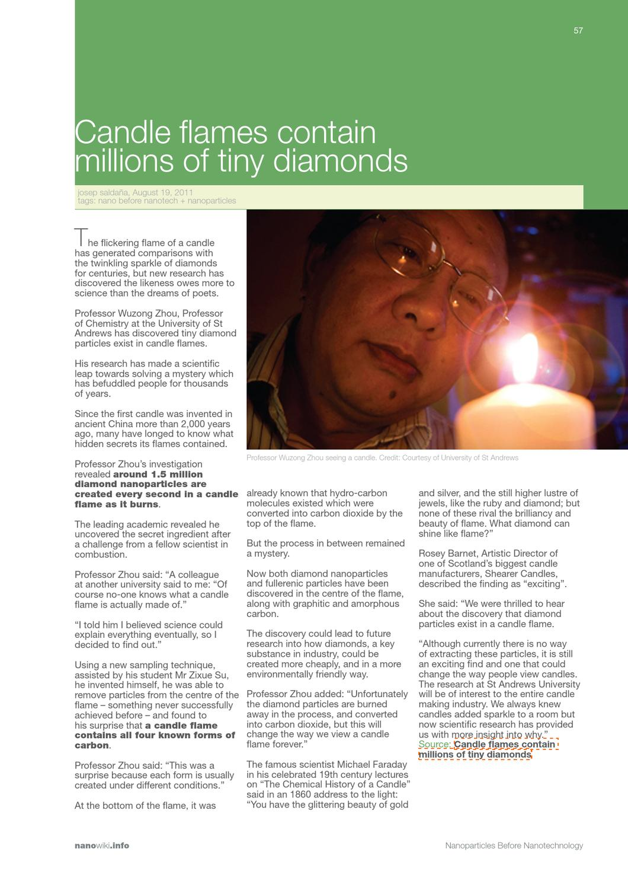

#### 향초의 기억

소이왁스 향초를 보고 있다. 기억 속에서 타오르는 향초를.

향초를 만들 때에는 ‘조 말론’ 브랜드에서 카피한 ‘우드세이지 앤 시솔트’ 향을 에센스로 넣었다. ‘바다소금’이라고 직역하기엔 섬의 땅에서 올라오는 비린내 같은 것이 더 진하다.

동대문 방산시장에서 향료 가게 사장님은 동대문 방산시장에서 20년 가까이 일하는 1세대 상인이라고 했다. 키는 작았지만 몸이 다부졌던 아저씨는 시장 반대편에서도 들릴 만큼 우렁우렁 낮게 외쳤다.

에센스 보고 가세요.

향초는 누리끼리하고 불투명하다. 불을 피우면 투명해지지만 불을 끄면 금세 걸쭉해져 감기 걸린 친구의 콧물처럼 변한다. 안에는 드라이플라워 장식이 박혀 있다. 엄지손톱만한 솔방울과 안개꽃 몇 송이, 국화꽃이 떠다니고 있다.

향초를 만들 당시 전 애인과 장식 꾸미는 방식으로 티격태격했다. 결국 하나씩 붙들고 각자 방식대로 꾸몄는데, 전 애인은 꽃송이를 심지를 중심으로 둥글게 얹었고 나는 잔의 외곽을 따라 꽃송이가 번져가는 식으로 만들었다.

장식할 당시에는 몰랐는데 나중에야 어렴풋이 깨달았다. 전 애인은 아름다운 것들을 마음의 중심에다 모아두는 사람이었고 나는 테두리에 미뤄두는 사람이었음을.

#### 촛불의 성분

빛이야 지상 어디에나 있지만, 어째서 촛불의 빛은 그토록 붉고 환할까. 사실은 이유가 있었다. 촛불이 타오를 때, 촛불 안에서는 1초에 무려 150만 개의 나노-다이아몬드 입자가 만들어진다. 초를 10분 동안 켜면 9억 개의 다이아몬드가 생겨났다가 이산화탄소로 변해 공중으로 날아가는 셈이다.

영국 세인트 앤드 루스 대학교 화학과의 저우 우종Wuzong Zhou 교수는 2011년, 촛불의 성분을 알아내기 위해 불꽃 내부의 물질을 채집하기로 했다.

불꽃의 하단부, 중심부, 상층부에서 여러 입자를 채집한 결과, 여러 종류의 탄소 물질과 함께 완벽한 수정 형태를 지닌 다이아몬드가 검출되었다. 고작 3 나노미터 수준이긴 하다. 실핀의 머리 부분에 30만 개나 올릴 수 있을 만큼 작은 크기다.

사실 나노-다이아몬드 자체를 연구한 논문을 보고 싶었지만 가격이 무려 42.50 파운드나 해서 포기. 그 대신에 이 분이 추가로 연구하신 '촛불 불꽃의 나노 크기의 촉매 및 숯검댕 입자 발달에 따른 미시 전자 연구’라는 논문을 들여다보았다. 여기에도 다이아몬드 입자가 검출된다는 증거 자료가 나와 있다.

- 원자 크기의 층이 겹겹이 쌓인 그래파이트 (탄소원자가 6개의 고리 모양으로 배열된 물질. 1896년 애드워드 G. 애치슨이 발견했고 이듬해부터 상업용 제품을 생산했다. 가벼운 특성 때문에 주로 입문자용 골프채에 쓰인다)구 graphitic sphereb.
- 나노-다이아몬드 조각과 그래파이트 구의 혼합체 graphitic spheres with nanodiamond particlesc.
- 나노-다이아몬드 조각을 둘러싸고 있는, 여러 탄소성분이 뒤죽박죽 섞여 있는 무정형 탄소 a nanodiamond particle surrounded by amorphous carbon compoundsd.
- 그래파이트 위에 붙어 있는 풀러린(60개의 탄소 원자가 축구공 모양으로 뭉쳐 있는 물질. 1985년에 합성에 성공했다. 안정적인 구조 덕분에 뜨거운 열기와 강한 압력을 견딜 수 있다. 윤활제, 촉매제 등등 활용 가능성은 무궁무진.) 조각(화살표가 가리키는 것) fullerene particles on the graphitic surface indicated by the arrows

#### 바슐라르의 관점

소이왁스 향초를 꺼트려 본다. 기억 속에서 타오르는 향초를. 심지 끝에는 깜부기불만 남아 반짝이고 짙은 연기가 피어오른다. (향초는 불어서 끄면 안 된다. 캔들 스너퍼로 불꽃을 덮어서 저절로 사그라들게 해야 한다) 빛을 응시하던 눈이 먹먹해진다. 꽃으로 피어올랐던 드라이플라워는 왁스가 굳어지며 화석으로 되돌아간다. 새카매진 나무 심지는 두 갈래로 벌어져 있다.

바슐라르는 촛불을 “위쪽을 향해 흐르는 모래시계”라고 했다. 모래를 아래로 흘려버리는 모래시계와 달리 가벼운 촛불은 하늘 위로 빛을 쌓아올린다.

늦은 밤, 몽롱한 기분으로 촛불을 보고 있으면 온갖 생각이 떠오를 것이다. 낮에 만났던 사람, 내일 해야 할 일 등등을 떠올리던 생각은 이내 시간을 훌쩍 뛰어넘어 그리운 과거나 잊고 싶은 악몽 가운데로 우리를 데려간다.

“밤샘하는 약한 불꽃과 꿈꾸는 혼 사이에는 하나의 친족 관계가 있”어서, 불꽃 앞에서 상상력과 추억은 하나가 된다. (바슐라르,『촛불의 미학』, 문예출판사, 2001, 33p.)

그러나, 초에서 빛이 만들어지는 곳은 이미 불타버린 부분이다. 불꽃에서 만들어지는 신비로운 물질들은 우리가 알아채기도 전에 이산화탄소로 붕괴된다. 불꽃이란 한때 보석이었던 것의 흔적에 지나지 않는다. 우리가 아름답다고 하는 것은 사실 ‘아름다웠던’ 것들이다.

나와 전 애인의 향초는 심지 높이를 잘못 맞춰서 몇 번 피우지도 못하고 쓸모없게 되었다. 우리는 이듬해 여름에 헤어졌다. 향초 만드는 도구는 그 아이의 스웨터, 목도리와 함께 우리 집 창고에 처박혔다가 지금은 어디론가 사라졌다.

어째서인지 내게 유일하게 남은 그 아이의 물건은 발사믹 식초 한 병뿐이다. 집에서 샐러드가 나오면 조금씩 뿌려 먹는다.
